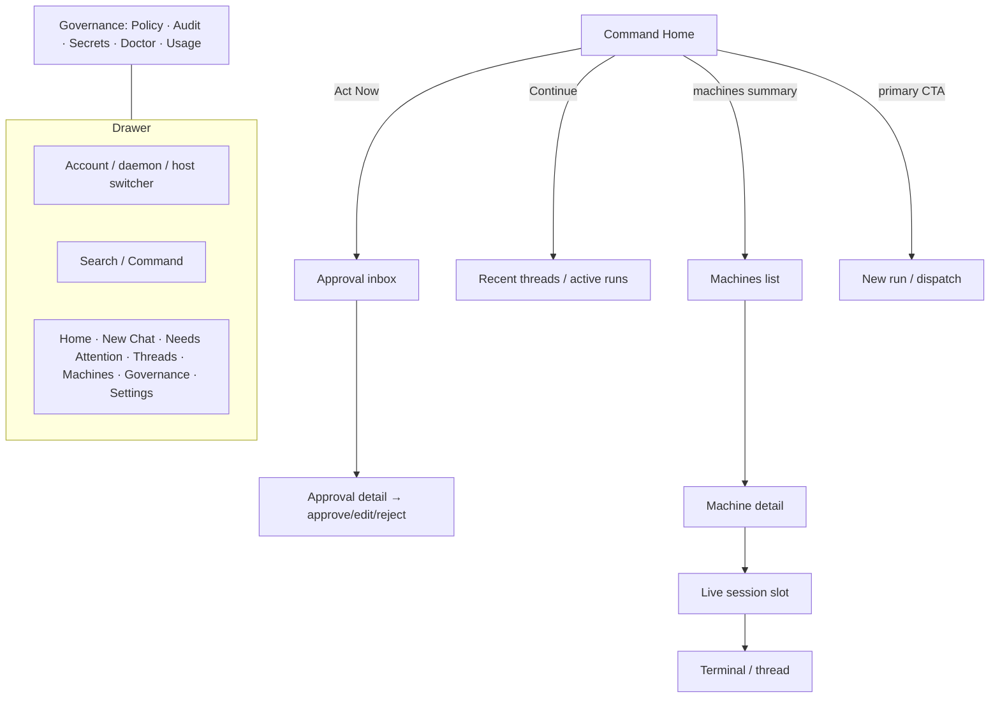

# 06 — Information Architecture

> Source: Wave-2 navigation/IA research (Mobbin + product docs + Apple HIG). Core finding: keep the sidebar / Command Home shell; do not reintroduce bottom tabs.

## Current IA

```
Sidebar / drawer (iPhone) · NavigationSplitView (iPad)
├── Command Home        ← attention-first: machines, recent threads, blocked approvals
├── New Chat            ← dispatch / creation surface
├── Needs Attention     ← approval inbox
├── Threads / Recent
├── Machines (Fleet)
├── Governance          ← policy, audit, trust/team
├── Settings
└── Observed Session    ← drill-in
```

`enum Tab` in `AppRoot.swift` is **vestigial** — do not resurrect a tab bar or a `Control`/`Activity` root.

### Problems with the current IA

- Sidebar footer hard-codes "Relay connected · 3 hosts" (should be live).
- Governance is one route but its home numbers are stubbed.
- Observed sessions fan out only to the live host.
- No global command/search primitive yet (each surface searches in isolation).

## Evidence: how strong apps organize complex functionality

| App / query | Evidence | Works / fails for Lancer | Lancer relevance |
|---|---|---|---|
| GitHub Mobile — "home dashboard notifications issues PRs search" | [Home](https://mobbin.com/screens/24b3cdbf-d26e-4908-8b30-2c5bcb593088), [PR/issues list](https://mobbin.com/screens/9be4aad3-c5b8-41a3-adc5-d60a940edccb); docs: mobile = quick triage | Works: Home + notifications as triage. Fails: bottom tabs imply peer product areas | Model **Needs Attention** as triage, not "Activity" as a root |
| Slack — "workspace switcher / unread / activity" | [Workspace flow](https://mobbin.com/flows/7226c577-2b21-403e-bc99-20cb31808c50), [activity/home](https://mobbin.com/screens/8e65f9c9-5b08-4303-8a56-ef403676143e) | Works: shallow fast identity switch. Fails: too many roots | Put account/daemon/workspace switcher at **drawer top** |
| Notion — "sidebar workspace switcher search recents" | [Sidebar](https://mobbin.com/screens/837966ac-94b9-458d-a2b1-a6b276e861e4) | Works: sidebar as map + recents/search | Drawer should expose **recent threads + active machines** |
| Linear — "issues inbox sidebar command menu" | [Command menu over issue list](https://mobbin.com/screens/c8989882-c549-4cf7-b57b-26deb3e0a994) | Works: dense lists + command layer | Add a command/search layer; route approvals to **review detail before action** |
| Vercel / Cloudflare — "dashboard command search sidebar account" | [Vercel command menu](https://mobbin.com/screens/d909174e-0619-4ab0-a1dc-f1a175c6f580), [Cloudflare dashboard](https://mobbin.com/screens/acce18ea-05f3-49ec-91af-b7a7c0b3065f) | Works: technical sprawl needs global search | **Search across threads, hosts, policies, approvals, audit** |
| Datadog / Better Stack / incident.io — "incidents alerts filters" | [incident.io filter list](https://mobbin.com/screens/58cf61e8-ef30-48f7-9e6d-cc3114595778); Datadog/Better Stack mobile docs | Works: urgency/status filters live near lists | Approvals + machine health need **inline severity/filter controls** |
| Tailscale / Termius — "devices/hosts terminal status" | Tailscale iOS redesign (machine details one tap, long-press copy/ping); Termius Vaults/Groups/Hosts/Keychain/Terminal | Works: host list first, terminal as drill-in | Fleet is a **machine/status list**, not a root terminal dashboard |
| Raycast / Arc — "command/search first mobile" | [Raycast search](https://mobbin.com/screens/4d2481a7-bade-4c3f-8f4b-e3cc8e8ca3f5), [Arc Search](https://mobbin.com/screens/720b0c2e-293b-4b62-afd9-ad7e04f4c6da) | Works: command entry beats feature browsing | Command Home should make **"what do you want the agents to do?"** primary |

## Proposed IA (refined, same shell)



### Command Home (primary destinations)
- **Act Now:** pending approvals, blocked runs, offline/degraded hosts, failed relay.
- **Continue:** recent threads and active runs.
- **Machines:** compact status summary (not full cards for every host).
- **Primary action:** New Chat / Dispatch.

### Drawer / sidebar
Top: account/org + active daemon/host switcher → Search/Command → Home → New Chat → Needs Attention → Threads/Recent → Machines → **Governance (Policy, Audit, Secrets, Doctor, Usage as one grouped destination)** → Settings.

### Depth (drill-down, not roots)
- Approval list → approval detail → approve/deny with risk/blast-radius/audit context.
- Machine list → machine detail → live session slot → terminal/thread.
- Audit/history → filter sheet → detail page.
- Hosted-cloud / V2 surfaces stay **hidden** from V1 navigation.

## Interaction rules

- **Cards** only for urgent "Act Now" items and compact summaries; **lists** for approvals, threads, machines, audit, logs.
- **Sheets** for account/daemon switching, filters, command palette, one-step contextual actions.
- **Navigation pushes** for chat, terminal, machine detail, approval detail, audit detail.
- **Status never relies on color alone:** icon + label + severity + timestamp.
- **Urgency ordering:** approval requiring decision → blocked agent → offline host → degraded relay → running session → recent work.

## Should chat remain the home screen?

**No** — chat is a depth surface and dispatch primitive; the home stays Command Home. (Full argument in [07 — Chat and Agent Experience](07-chat-and-agent-experience.md).)

## Source anchors

Apple HIG: [Sidebars](https://developer.apple.com/design/human-interface-guidelines/sidebars), [Tab bars](https://developer.apple.com/design/human-interface-guidelines/tab-bars/), [Sheets](https://developer.apple.com/design/human-interface-guidelines/sheets), [NavigationSplitView](https://developer.apple.com/documentation/swiftui/navigationsplitview). Product docs: [GitHub Mobile](https://docs.github.com/en/get-started/using-github/github-mobile), [Linear Inbox](https://linear.app/docs/inbox), [Datadog Mobile](https://docs.datadoghq.com/mobile/?tab=ios), [Better Stack mobile](https://betterstack.com/docs/uptime/ios-and-android-mobile-apps/), [Tailscale iOS redesign](https://tailscale.com/blog/reimagining-tailscale-for-ios), [Notion sidebar](https://www.notion.com/help/navigate-with-the-sidebar), [Raycast iOS](https://www.raycast.com/ios), [Arc Search](https://resources.arc.net/hc/en-us/articles/20887042551831-Arc-for-iOS-Android-Arc-Search).
