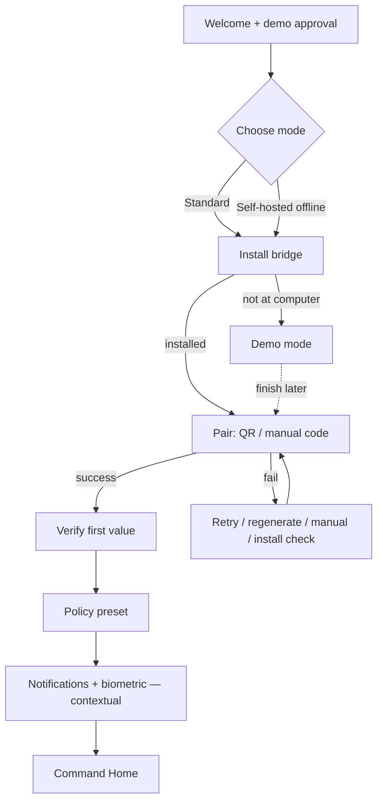

# 10 — Onboarding and Pairing

> Source: Wave-2 onboarding/activation/pairing/trust research (Mobbin flows + Apple HIG + product docs). Recommendation: first run is a **trust-building setup checklist**, not a marketing carousel or login wall.

## Current onboarding (from code)

- V1 is **E2E relay first**: the phone pairs to the relay; `lancerd` runs on the host; the phone is **not** the SSH session holder ([ARCHITECTURE.md:49](/Users/roshansilva/Documents/command-center/ARCHITECTURE.md)).
- Onboarding already puts **value before account creation** ([OnboardingRedesignGalleryView.swift:75](/Users/roshansilva/Documents/command-center/Packages/LancerKit/Sources/OnboardingFeature/OnboardingRedesignGalleryView.swift)).
- Account choice correctly separates "Lancer account" from "Self-hosted offline" ([AccountEntryView.swift:80](/Users/roshansilva/Documents/command-center/Packages/LancerKit/Sources/OnboardingFeature/AccountEntryView.swift)).
- Pairing UI expects `lancerd pair`, QR scan, or manual code, but should be reframed as a **checklist** ([OnboardingRedesignGalleryView.swift:444](/Users/roshansilva/Documents/command-center/Packages/LancerKit/Sources/OnboardingFeature/OnboardingRedesignGalleryView.swift)).
- Device management exists but its empty state points back to onboarding instead of offering a direct "bind daemon" action ([DeviceManagementView.swift:63](/Users/roshansilva/Documents/command-center/Packages/LancerKit/Sources/SettingsFeature/DeviceManagementView.swift)).
- Paywall copy is already the right posture: one-time purchase, no subscription for own hardware ([PaywallSheet.swift:30](/Users/roshansilva/Documents/command-center/Packages/LancerKit/Sources/SettingsFeature/PaywallSheet.swift)).

> **Open defect (P1-1 in [03](03-current-ui-audit.md)):** the active onboarding says the *desktop* generates the pairing code while `BridgePairingView` says the *phone* generates the QR/code. Pick one direction-of-trust before redesign.

## Evidence (Mobbin + platform)

- **AI apps:** [Microsoft Copilot onboarding](https://mobbin.com/flows/f96a399d-d7d9-4c68-a3e0-a27edd49b97d) reaches usable chat with sample prompts, sign-in optional. Borrow "sample first value," not generic AI branding.
- **Pairing:** [WhatsApp linked devices](https://mobbin.com/flows/68f4feef-9d10-4a55-bee2-e907a859ca4e) explains multi-device use, reassures about E2EE, offers QR + fallback, then shows linked devices with logout. Map to QR/code/manual install + revoke.
- **Permissions:** [Brave VPN install](https://mobbin.com/flows/1313abab-3faf-4016-98d6-7d79affd54b5) explains the system permission before the iOS dialog. Pre-explain notifications, camera QR, and biometric gates.
- **Security:** [Marcus security setup](https://mobbin.com/flows/ceb716a9-5d1a-4a8b-b7d0-bcf57c92be34) uses a step indicator + inline rationale. Use "Step 2 of 4" clarity for install/pair/policy.
- **Setup checklists:** [adidas Running setup checklist](https://mobbin.com/screens/3fcdcd68-d19a-4fdd-a669-4d058704d9be) shows optional device setup without blocking "ready to go." Let users skip SSH while still completing relay approvals.
- **Device management:** [Telegram devices](https://mobbin.com/flows/c87c28ac-b009-446a-aa07-d19d6ad9df7c) + [WhatsApp device status](https://mobbin.com/flows/68f4feef-9d10-4a55-bee2-e907a859ca4e) for visible active devices + revoke.
- **Apple posture:** ask permissions in context, explain why first, avoid setup gates ([Onboarding HIG](https://developer.apple.com/design/human-interface-guidelines/onboarding), [protected resources](https://developer.apple.com/documentation/uikit/requesting-access-to-protected-resources), [UN authorization](https://developer.apple.com/documentation/usernotifications/unusernotificationcenter/requestauthorization%28options%3Acompletionhandler%3A%29)).
- **Purchase posture:** core client purchase via StoreKit, restore path, no steering around IAP, no in-app external-price comparison ([App Store Review Guidelines](https://developer.apple.com/app-store/review/guidelines/)).

> **Competitive risk:** OpenAI Codex / Claude / mobile-agent tools make "mobile approvals" less differentiated. Onboarding should lead with **policy, audit, blast radius, emergency stop, own-machine privacy** — not "chat with agents from your phone."

## Ideal first-run journey

1. **Welcome / demo approval** — one realistic sample approval card (agent, command, cwd, risk, files touched, Allow once / Reject / Always allow). CTA: "Try a demo approval." No sign-in, no permission prompt yet.
2. **Choose mode** — Standard account (recovery, registered devices, billing, multi-device) vs Self-hosted offline (no Supabase/recovery/account device list, still supports relay pairing). Default: Standard, but keep offline visually equal for trust.
3. **Install bridge** — checklist row "Install Lancer on your computer," copyable command + "What this installs" disclosure, "Already installed" path, "I'm not at my computer" → demo mode.
4. **Pair** — QR primary, manual 6-digit code secondary. Pre-camera: "Camera is only used to scan the pairing code." Pairing screen shows relay status, expiry, retry, and "wrong QR" recovery. Success names the machine + "E2E relay paired."
5. **Verify first value** — run a safe local "doctor" / demo approval. Show checklist completion: Bridge connected, notifications ready, first approval delivered, audit entry created. **Time-to-value target: < 3 min (already-installed host), < 6 min (fresh install).**
6. **Policy** — replace "How much rope?" with plainer trust language: Conservative (ask before writes/installs/secrets/network), Balanced (ask for risky mutations), Fast (ask only for critical). Link each to examples.
7. **Notifications + biometric** — ask notifications only **after** pairing/verification ("so approvals reach you when away"). Ask biometric only **before** approving critical actions or enabling allow-always rules.
8. **Command Home** — land with paired machine, latest approval/demo card, next action. Empty states are setup checklists, not blank lists.

## Required branches

| Branch | Behavior |
|---|---|
| Already-installed host | Start at pair; detect success; skip install education; show "verify approval." |
| Not installed | Install checklist first: command, platform selector, troubleshooting, "send instructions to my computer." |
| Multiple devices | After first pair, show device list (status, last active, fingerprint, revoke); offer "pair another machine." |
| Pairing succeeds | Show machine name, relay state, policy preset, first safe approval/audit proof. |
| Pairing fails | Show exact state (relay unreachable, code expired, wrong QR, daemon not running, already paired elsewhere). Actions: retry, regenerate, manual code, install check. |
| Network unavailable | Continue in demo mode; persist "finish pairing later"; never dead-end at QR. |
| Permissions denied | Camera → manual code; notifications → in-app Inbox still works + Settings instructions; biometrics → passcode fallback or fail-closed for critical. |
| Explore before pairing | Realistic demo workspace (sample approvals, audit, policy simulator, device-management preview). Banner: "Demo data. Pair a bridge to control your machines." |
| Paywall timing | **No paywall before demo/pairing.** Show Pro only when a Pro feature is tapped or after first value, with "pay once, own hardware free" posture. (See [11](11-monetization-and-upgrade-strategy.md).) |

## First-run flow diagram

## High-confidence UX requirements

- Add a **persistent setup-checklist component** reused in onboarding, Command Home empty state, and Settings → Connection.
- Make **"install bridge" a first-class step** before QR pairing.
- Keep account **optional** for self-hosted offline; don't make trust depend on cloud identity.
- Every scary permission gets a **pre-permission screen** and a **no-permission fallback**.
- Treat the **first approval** as the activation moment, not account creation.
- Do not lead with terminal/chat. Lead with "policy enforced, risk explained, audit recorded."
