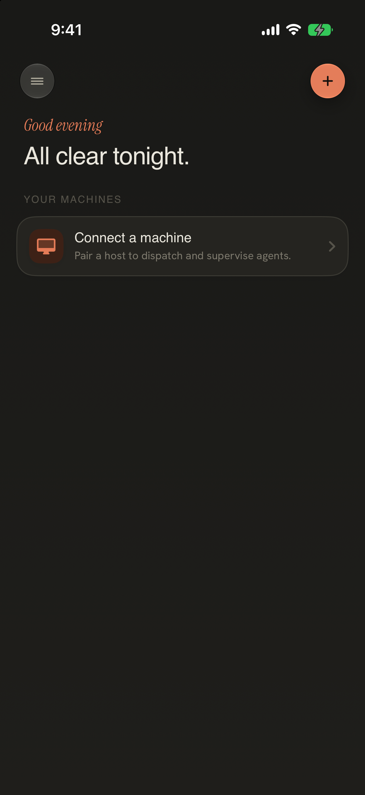
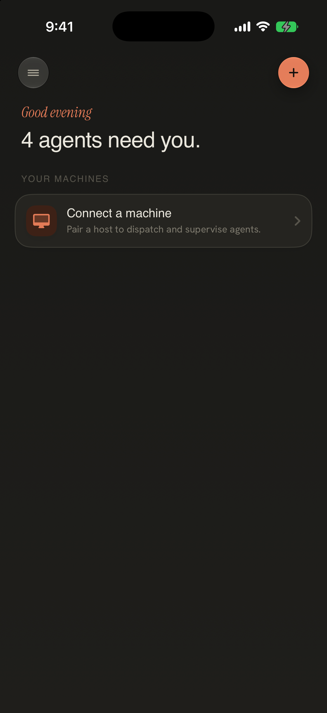
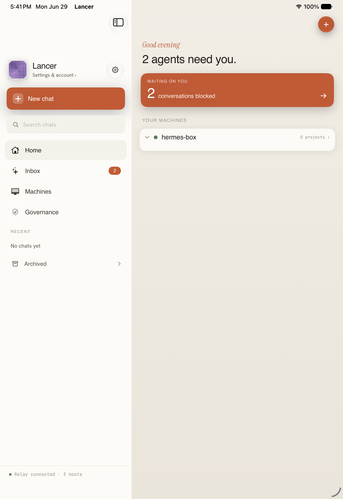
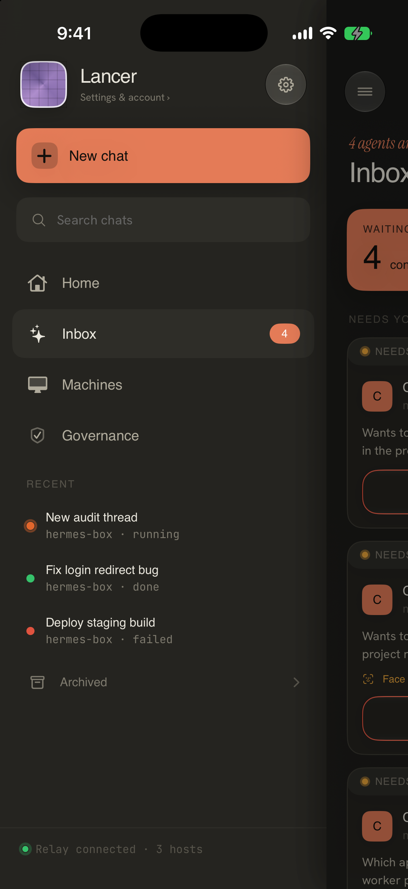

# Workflow 02: Home / Attention Overview

Status: **approved direction — Cursor-style ledger** (doc/wireframe only; no SwiftUI implementation in this phase)  
Updated: 2026-07-05

## Locked Direction — 2026-07-05

Command Home should move from the current dashboard/card treatment to a **Cursor-style daily ledger**:

- sparse white canvas;
- simple top chrome: back/sidebar, search, menu;
- selected workspace/repo as the page title;
- grouped rows for `Needs you`, `Today`, and `Yesterday`;
- bottom composer always present except Settings;
- machine/repo/agent/model selection in bottom sheets, not inline dashboard modules;
- no big hero headline like “4 agents need you”;
- no default `YOUR MACHINES` card stack on Home.

The approved wireframe artifact is:

- [Core wireframe board](../lancer-core-wireframes-2026-07-05/index.html#home)
- [Command Home ledger wireframe](../command-home-ledger-2026-07-05/index.html)
- [Preview image](../command-home-ledger-2026-07-05/preview.png)

Going forward, the **Core wireframe board** is the working visual file. The single-flow board above is preserved as the first approved source, but new iterations should happen in the combined board.

### What Stays From Lancer

The simpler UI does **not** remove Lancer’s feature depth. It changes where that depth appears:

| Capability | Home treatment |
| --- | --- |
| Blocked questions | Promoted row in `Needs you`: `Blocked · pick a phrasing` |
| Risky approvals | Promoted row in `Needs you`: `Approval waiting · high risk` |
| Failed proof / tests | Promoted row in `Needs you` or top of `Today`: `Tests failed after retry` |
| Proof ready | Row state: `Proof ready`, opens Work Thread proof detail |
| Checks passed | Quiet row metadata with checkmark and optional diffstat |
| Machine/repo context | Page title, row subtitle, or composer picker sheet |
| Multi-agent/model choice | Composer bottom sheet, not a Home module |
| Changed files / PR / Mark Ready | Work Thread detail, not Home |

### Page Model

1. **Home ledger** — daily triage list, closest to the Cursor screenshots.
2. **Work item detail** — opens from a row; carries proof, changed files, PR/ready actions, and a follow-up composer.
3. **Composer expanded sheet** — one input with two selectors: where it runs and which agent/model handles it.
4. **Run-on picker sheet** — recent machine/repo combos first, then all machines/repos.
5. **All-clear state** — still a ledger, but with a calm “No decisions right now” row and one clear next action via the composer.

### Open Design Decision

Keep `Needs you` as a top group for now. It gives Lancer one place to promote blocked questions, failed proof, and high-risk approvals without reverting to a dashboard headline. If it starts to feel too sectioned, fold urgent items into `Today` while keeping the same row styling.

## Current Screenshots

### Primary path (refreshed 2026-06-30, iPhone 17 Pro, dark)

### Reference captures (Jun 29–30)

### Capture recipe

| State | Launch env | Notes |
| --- | --- | --- |
| All clear | `LANCER_DESTINATION=sessions` on a **fresh install** (no `LANCER_UITEST_RESEED`, no `LANCER_SEED_DEMO`) | Dismiss system notification prompt once; headline = “All clear tonight.” |
| Pending headline | `LANCER_DESTINATION=sessions` + `LANCER_UITEST_RESEED=1` | Seeds 4 pending approvals in repo; headline = “4 agents need you.” |
| Seeded machine | above + `LANCER_FAKE_RELAY_HOST=hermes-box` | Shows `hermes-box` in YOUR MACHINES without a live relay |
| Sidebar open | above + `LANCER_DRAWER_OPEN=1` | Opens compact drawer over Home |
| Inbox rows | `LANCER_DESTINATION=inbox` + `LANCER_UITEST_RESEED=1` | Full approval list (Workflow 04 overlap; useful for row anatomy) |

Full-res captures: `xcrun simctl io <UDID> screenshot /tmp/foo.png` then copy into `docs/design-audit/screenshots/current/`.

## Current Structure

Home (`LancerHomeView`) is the default destination after onboarding. In V1 it should answer three questions quickly:

1. What needs my attention right now?
2. What is actively running on my machines?
3. Are my machines connected and safe?

The locked V1 docs describe Home as an **attention-first** surface with machine health and a secondary composer entry. It must not become a generic chat home, a terminal, or a dashboard of synthetic trust numbers.

### Implementation map (corrected paths)

| Area | File |
| --- | --- |
| App shell / Home wiring | `Packages/LancerKit/Sources/AppFeature/AppRoot.swift` |
| Home UI | `Packages/LancerKit/Sources/AppFeature/LancerHomeView.swift` |
| Sidebar | `Packages/LancerKit/Sources/AppFeature/LancerSidebarView.swift` |
| Navigation state | `Packages/LancerKit/Sources/AppFeature/SidebarShellState.swift` |
| Attention projection | `Packages/LancerKit/Sources/LancerCore/AttentionItem.swift` |
| Fleet + attention items | `Packages/LancerKit/Sources/AppFeature/FleetStore.swift` |
| DEBUG seed / UITest reseed | `Packages/LancerKit/Sources/AppFeature/DebugSeeder.swift` |

### What the current Home actually renders

1. **Top row** — hamburger (opens sidebar) + New Chat (+).
2. **Greeting + headline** — time-based greeting; headline from `pendingApprovalCount` (`activeInboxViewModel`, repo-backed).
3. **NEEDS ATTENTION** (conditional) — only when `fleetStore.attentionItems` is non-empty (requires **connected fleet slots** with inbox VMs, not repo-only seeds).
4. **YOUR MACHINES** — relay host via `LANCER_FAKE_RELAY_HOST` / stored pairing, or `connectMachineCard` empty state; expandable session tree with `sessionsLoading` row.

## Current Issues

| Issue | Evidence | Severity |
| --- | --- | --- |
| **Split-brain attention** | With `LANCER_UITEST_RESEED=1`, headline says “4 agents need you” but **NEEDS ATTENTION section is absent** because `FleetStore.attentionItems` only projects from fleet slots, while `pendingApprovalCount` reads `activeInboxViewModel` (repo / live VM). | P0 UX — user sees urgency in headline with nowhere to act on Home |
| **Hardcoded sidebar footer** | `LancerSidebarView.relayFooter` always shows `Relay connected · 3 hosts` | P0 trust — violates “no fake metrics” guardrail |
| **Inbox vs Home duplication** | Sidebar still exposes **Inbox** as a separate root with badge; Home direction is attention-first | P1 IA — two mental models for the same work |
| **Governance in sidebar** | Fourth root “Governance” competes with Settings and is out of V1 four-root IA | P1 IA |
| **All-clear is text-only** | “All clear tonight.” with empty machine card — no connected-state summary or gentle next action beyond pairing | P2 polish |
| **Loading state is ephemeral** | `sessionsLoadingRow` (“Loading sessions on this Mac…”) flashes briefly; hard to screenshot without a debug slow-path | Doc gap |
| **Offline machine card** | `offlineMachineCard` exists in code but needs offline fleet slot + pending approvals — not seedable today without live SSH slot | Doc gap |
| **iPad split** | Existing capture is Jun 29; not refreshed this pass | Low — structure unchanged |

## Mobbin / Pattern References

| Example | What it does well | Adapt for Lancer | Do not copy directly |
| --- | --- | --- | --- |
| [GitHub Inbox](https://mobbin.com/screens/c52d3c07-2f2f-422d-b9f1-28457b741bf5) | Actionable feed: repo, age, title, status snippet, swipe-to-done | NEEDS ATTENTION rows: machine, agent, risk, age, Review | GitHub’s repo/PR taxonomy |
| [GitHub all-done empty](https://mobbin.com/screens/67ef057b-19a1-4507-a636-6bf67241a9dd) | Calm “All done here!” with return path | All-clear Home: confirm caught up + one next action (pair / open Work) | Octocat illustration tone |
| [Linear Inbox](https://mobbin.com/screens/f688fc71-2060-49c2-be67-bc6ab5e53bee) | Dense triage, unread dots, filter sheet | Attention row metadata + optional “see all” to Inbox | Linear’s issue IDs |
| [Todoist Today empty](https://mobbin.com/screens/9372f97b-a422-49e6-b9fa-4eb3d6b281fe) | Illustration + instructional copy + primary CTA | All-clear + no machines: pair CTA, not decorative illustration | Productivity-app whimsy |
| [Spark Mail empty folder](https://mobbin.com/screens/9742d639-4ec2-49f2-aff3-17c7a81c595b) | Thematic empty state, segmented Open/Done | Separate “pending” vs “recent decisions” on Home | Email folder IA |
| [GitHub Mobile Home](https://mobbin.com/screens/24b3cdbf-d26e-4908-8b30-2c5bcb593088) | Prioritizes actionable work without desktop parity | Compact attention feed with clear next actions | Repo activity taxonomy |
| [incident.io incident list](https://mobbin.com/screens/58cf61e8-ef30-48f7-9e6d-cc3114595778) | Severity, owner, time, status cleanly | Risk on attention rows without panic styling | Outage aesthetics |
| [Slack workspace flow](https://mobbin.com/flows/7226c577-2b21-403e-bc99-20cb31808c50) | Workspace context separate from attention | Sidebar = machine/workspace context | Channel-first IA |
| [Notion sidebar](https://mobbin.com/screens/837966ac-94b9-458d-a2b1-a6b276e861e4) | Calm dense navigation for split layouts | iPad sidebar rhythm | Document nesting |

### Fresh Mobbin pass: 2026-06-30

Additional all-clear / inbox references:

- [Brex home](https://mobbin.com/screens/b7d8dc8b-337d-4003-9f81-c52610f549c0) — calm dashboard with real balances; borrow **restraint**, not fintech chrome.
- [monday.com My Work](https://mobbin.com/screens/2b99e73d-cd4d-4914-812b-97a10d16bd3b) — grouped action items with progress; useful for “active work” module below attention.
- [Jira empty board](https://mobbin.com/screens/9d74be79-8a49-43c6-a6b1-26155d38ac2f) — “No work yet” + create CTA; maps to no-machines / all-clear pairing prompt.

**Net:** Home should feel like **GitHub/Linear inbox clarity** on the attention block, **Todoist/GitHub calm** on all-clear, and **incident.io restraint** on risk — not a metrics dashboard.

## Superseded June 30 Direction

The June 30 direction below is useful background, but the July 5 Cursor-style ledger direction above wins where they conflict.

## Chosen Direction

**Scope:** Targeted redesign of Home hierarchy + sidebar footer + attention data wiring. **Not** a full app shell rewrite in V1 — keep sidebar / split structure.

Home was previously framed as an **attention-first control overview**:

| Operating state | Top of Home | Primary action |
| --- | --- | --- |
| Needs attention | Highest-severity `AttentionItem` first (max 2 on Home, “See all” → Inbox) | **Review** |
| Active work | Compact running-run rows under attention | Open Work Thread |
| All clear | Calm headline + connected machine summary (or honest empty) | Pair machine / New Chat |
| Machine offline | Named machine + what still works on phone | Reconnect / View queued decisions |

### Fixes required before ship (design + implementation, post-approval)

1. **Unify attention source** — `pendingApprovalCount`, NEEDS ATTENTION cards, and sidebar Inbox badge must read the **same projection** (repo approvals when no fleet slot, slot inbox when connected). Headline must not claim “4 agents need you” with zero Home cards.
2. **Remove fake sidebar footer** — replace `Relay connected · 3 hosts` with live relay + saved-host count from `FleetStore` / pairing state, or hide footer when unknown.
3. **Collapse Inbox into Home for V1** — keep Inbox route for deep list / “See all”, but Home owns the first two urgent items; badge counts stay in sync.
4. **All-clear module** — below headline when `attentionItems.isEmpty && pendingApprovalCount == 0`: one line of machine/relay truth + single CTA (pair or open Work), inspired by GitHub “All done here!” / Todoist instructional empty (no cartoon illustration required).
5. **Row anatomy** (from Inbox capture + Mobbin): machine · agent · tool/command · risk label · relative age · Review.

Do **not** lead with New Chat. Composer stays secondary unless all-clear **and** machine connected.

## Proposed Screen Structure

1. **Status strip (optional, compact)** — relay/SSH health summary; offline banner only when degraded.
2. **Headline** — single sentence operating state (must match attention module).
3. **Primary attention module** — 0–2 cards from `AttentionItem`; expired approvals visually distinct (already in code).
4. **Active work** — observed sessions / running count on machine cards (existing `MachineTreeCard`).
5. **YOUR MACHINES** — tree or connect card; loading skeleton preserves layout (`sessionsLoadingRow`).
6. **Recent decisions** — short audit feed (future; can link to Inbox filtered).
7. **Sidebar / iPad** — four roots: **Home, Work, Machines, Settings**; demote Governance to Settings; Inbox becomes “Approvals” sub-destination or Home “See all”.

## Required States

| State | Design requirement | Captured? |
| --- | --- | --- |
| All clear, no machines | Calm headline + pair CTA | **Yes** — `home-command_all-clear_*` |
| Pending headline, no Home cards | **Bug state today** — should not ship; doc shows split-brain | **Yes** — `home-command_pending-headline_*` |
| NEEDS ATTENTION cards on Home | Highest item + Review | **No** — needs fleet slot + pending inbox VM; use Inbox capture as row reference |
| Seeded / relay machine | Machine tree, green dot | **Yes** — `home-command_seeded-machine_*` |
| Loading sessions | Skeleton row, no layout jump | **No** — ephemeral; specified in code |
| Machine offline + pending | Named machine, recovery copy | **No** — not seedable without connected slot going offline |
| Sidebar drawer | Four roots, badge sync | **Yes** — `sidebar-drawer_open_*` (footer still fake) |
| iPad split | Same IA as phone | **Partial** — Jun 29 capture only |

## Designer Notes

- **Hierarchy:** attention → active work → machines → recent context.
- **Density:** tighter than onboarding; align with Inbox row density from capture.
- **Typography:** factual row titles; mono captions for section headers (keep `NEEDS ATTENTION` label).
- **Risk:** text + symbol (existing warning icon + risk capsule); never color alone.
- **Motion:** subtle insert/remove on attention rows only.
- **Accessibility:** VoiceOver order — state headline → attention item → risk → action button.

## Implementation Notes

- Build around `AttentionItem` + a **single** `AttentionProjection` fed to Home headline, Home cards, and sidebar badge.
- Use `FleetStore.connectionState(for:)` for machine dots; relay dot from `relayHostConnected` (already wired).
- Delete `relayFooter` hardcode; wire real counts or remove footer until data exists.
- Reusable components: attention row (already partial in `approvalAttentionCard`), machine status badge, empty/offline/error states.
- DEBUG seams: `LANCER_UITEST_RESEED`, `LANCER_FAKE_RELAY_HOST`, `LANCER_DRAWER_OPEN`, `LANCER_DESTINATION` — document in gallery for QA.
- Verify iPhone compact, iPhone large, iPad split after implementation.

## Approval Ask

Approve Home as an **attention-first overview** with:

1. Unified attention projection (headline + cards + badge),
2. Real sidebar connectivity footer (no fake host counts),
3. All-clear and pair-machine empty states that feel intentional,
4. Inbox demoted to “See all approvals” rather than a competing home,

—not a chat-first home, terminal, or metrics dashboard.

Reply **approve**, **revise** (with notes), or **skip** to proceed to Workflow 03.
