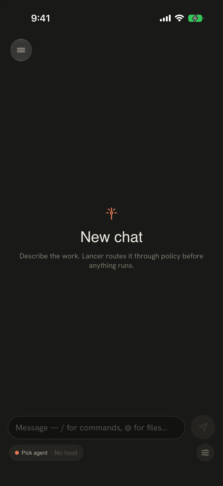
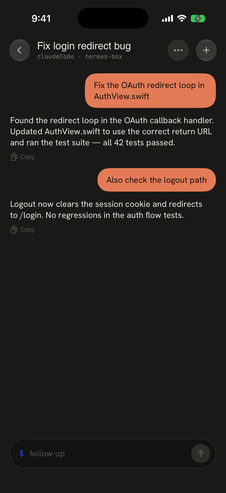
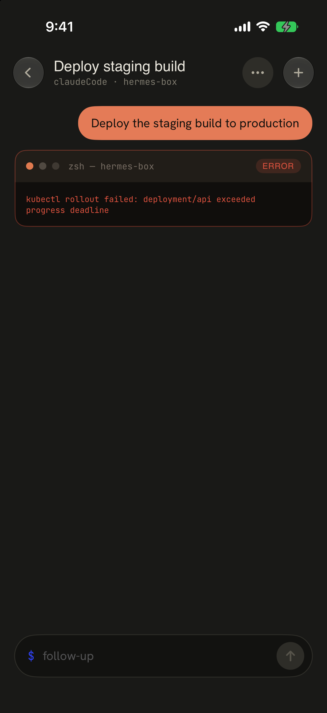
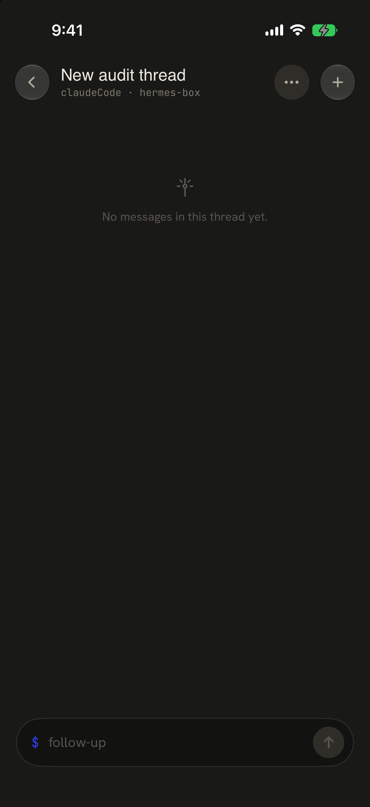

# Workflow 03: Work Thread

Status: **approved direction — Cursor-dark transcript with Lancer proof artifacts** (doc/wireframe only; no SwiftUI implementation in this phase)  
Updated: 2026-07-05

## Locked Direction — 2026-07-05

Work Thread should follow the Cursor mobile chat reference more closely than the June 30 “delivery timeline” direction. The approved model is a **dark transcript with structured Lancer artifacts**:

- dark, full-screen reading surface;
- large circular back and menu controls;
- centered thread title with machine/host affordance;
- user prompt bubble when useful;
- agent output as readable prose, not a terminal dump;
- code paths and commands styled inline with mono highlights;
- native artifact cards for to-dos, proof, changed files, approvals, and failed proof;
- sticky action rail above the composer (`View PR`, `Mark Ready`, `Review`, `Retry`, etc.);
- bottom `Follow up...` composer always available for governed steering;
- raw command output collapsed behind “Show output,” not shown by default.

The approved wireframe artifact is:

- [Core wireframe board](../lancer-core-wireframes-2026-07-05/index.html#thread)
- [Work Thread Cursor wireframe](../work-thread-cursor-2026-07-05/index.html)
- [Preview image](../work-thread-cursor-2026-07-05/preview.png)

Going forward, the **Core wireframe board** is the working visual file. The single-flow board above is preserved as the first approved source, but new iterations should happen in the combined board.

### What Stays From Lancer

The UI should look and feel Cursor-simple, but it must expose Lancer’s extra power as native artifacts:

| Capability | Work Thread treatment |
| --- | --- |
| Agent transcript | Main scroll surface; prose-first, readable, dark |
| Plans / task briefs | Rounded transcript card, matching Cursor’s prompt/attachment card treatment |
| To-dos | Compact checklist card; completed items dimmed and struck through |
| Proof ready | Green proof card with tests/checks/files summary |
| Changed files | `Changes N` card with file rows and diffstat |
| PR / ready actions | Sticky action rail above composer |
| Risky approval | Amber approval card with sticky `Review` / `Deny` actions |
| Failed proof | Red failure card with last good step, failed command, retry/fix actions |
| Raw logs / terminal | Collapsed detail only; never the default reading mode |

### Superseded Assumption

The June 30 doc framed Work Thread as a “run timeline + activity log” and warned against chat-first UI. Cursor’s actual mobile thread shows a better target: keep the chat/transcript shape, but make it **less chatty and more artifact-rich**. Do not replace the thread with a delivery-app timeline.

## Current Screenshots

### Primary path (refreshed 2026-06-30, iPhone 17 Pro, dark)









### Related context


### Capture recipe

| State | How to reach | Notes |
| --- | --- | --- |
| New Chat composer | Tap **Start a new chat** (+) from Home, or sidebar **New chat** | `LANCER_FAKE_RELAY_HOST=hermes-box` helps machine list; composer may still show **Pick agent · No host** until dispatch agents resolve |
| Persisted threads | Seed `chat_conversations` + `chat_turns` in simulator DB (see below), then open from sidebar **Recent** | Requires app launch once so `Library/Application Support/Lancer/db.sqlite` exists |
| Completed / failed / empty | Seed IDs: `audit-completed`, `audit-failed`, `audit-empty` | Failed turn uses `DarkTerminalBlockCard` with ERROR styling |
| Sidebar recent | `LANCER_DRAWER_OPEN=1` + seeded conversations | Use drawer capture from Workflow 02 if thread list visible |

**DB seed snippet (DEBUG audit only):** after one app launch, insert into `chat_conversations` / `chat_turns` / `chat_fts` on the simulator's `db.sqlite`. UITest reseed does **not** seed chats today — manual sqlite insert or future `DebugSeeder.seedChats` seam recommended.

**Not captured (gaps):**

- **Active running thread** — needs live `performDispatch` + streaming `RunOutputStore` (typing indicator, terminal blocks).
- **Waiting for approval inline** — `NewChatTabView.isAwaitingApproval` + `inlineApprovalCard`; requires live run blocked on policy.
- **Observed / watch-only session** — `ObservedSessionView` needs `loadTranscript` data from connected slot or relay.
- **Loading transcript** — `ObservedSessionView` / `ChatHistoryView` skeleton not held long enough to screenshot.

## Current Structure

V1 product language calls this surface **Work Thread**: a read-only **activity log** for one agent run, with governed reply/steer — **not** an interactive terminal or phone IDE.

### What the code actually ships today

| Surface | File | Role today |
| --- | --- | --- |
| **New Chat / live thread** | `Packages/LancerKit/Sources/AppFeature/NewChatTabView.swift` | Default "start work" composer + inline multi-turn transcript; streams via `RunOutputStore`; stop/pause/budget; inline approval cards; `DarkTerminalBlockCard` for tool blocks |
| **Persisted history** | `Packages/LancerKit/Sources/AppFeature/ChatHistoryView.swift` | Read-only turns from `ChatConversationRepository`; optional follow-up bar when `onContinue` resolves a live channel |
| **Observed session** | `Packages/LancerKit/Sources/AppFeature/ObservedSessionView.swift` | Watch-only host session transcript (Claude Code, etc.); no composer; biometric gate |
| **Run detail (legacy path)** | `Packages/LancerKit/Sources/AppFeature/RunDetailView.swift` | HUD + raw output stream + approval banner — used outside main sidebar thread in some flows |
| **Interactive SSH terminal** | `Packages/LancerKit/Sources/SessionFeature/SessionView.swift` | Full PTY terminal — **V1 must not surface** in navigation |
| **Output model** | `Packages/LancerKit/Sources/AppFeature/RunOutputStore.swift` | Live run chunks, tool blocks, combined text |
| **Transcript chrome** | `Packages/LancerKit/Sources/SessionFeature/Chat/DarkTranscriptComponents.swift` | `DarkTranscriptHeader`, bubbles, typing indicator, terminal cards |

**Navigation:** Sidebar `.thread(id:)` → `ChatHistoryView`. **New Chat** (`.newChat`) → `NewChatTabView`. There is no separate "Work root" list in the shell — threads live in sidebar **Recent** and under Home's machine tree when relay is seeded.

## Current Issues

| Issue | Evidence | Severity |
| --- | --- | --- |
| **Chat mental model vs V1 spec** | Captures show ChatGPT-style user bubbles + assistant prose; V1 spec describes phase summary, activity log, changes, inline approval summary — not a chat app | P0 IA — strongest drift in the product |
| **Terminal blocks as default output** | `DarkTerminalBlockCard` (macOS window chrome, ERROR badge) on failed turns reads as shell/terminal, not governed activity | P0 trust / readability |
| **No phase grouping** | Turns are prompt/response pairs only; no "Running tests", "Waiting for approval", "Completed" module | P1 — user must parse prose |
| **Split live vs history** | `NewChatTabView` owns live runs; `ChatHistoryView` is separate — reopening a thread does not show the same chrome as an active run | P1 continuity |
| **Composer always visible** | New Chat + history follow-up bar imply phone-origin coding; V1 allows reply/steer but spec says secondary to activity log | P1 — scope creep risk |
| **No Work Thread header metadata** | Header shows title + `agent · host`; missing branch, run state badge, elapsed time, current step (per `V1_PRODUCT_SPEC.md`) | P1 |
| **Fake relay ≠ dispatch agent** | Composer shows **Pick agent · No host** with `LANCER_FAKE_RELAY_HOST` — machine list works but composer agent chips don't | P2 capture/debug seam |
| **SessionView still in tree** | Interactive terminal exists; must stay off V1 routes | P0 if surfaced — verify nav guardrails |
| **Sidebar thread switch** | Tapping another recent thread while already on `.thread` may not swap detail without Back first (navigation quirk) | P2 engineering |

## Mobbin / Pattern References

| Example | What it does well | Adapt for Lancer | Do not copy directly |
| --- | --- | --- | --- |
| [Bolt Food delivery timeline](https://mobbin.com/screens/9509b853-f44c-425e-81c0-c6e96efffe2c) | Phase steps with timestamps; current step highlighted | Work Thread **current state module** above chronological detail | Delivery-app visual language |
| [Glovo order status](https://mobbin.com/screens/1b21deb2-e066-4ed3-a8c7-72b693406fa1) | "Now" badge on active step; plain language status | Running / waiting / failed phase chip | Food courier framing |
| [Shop delivery progress](https://mobbin.com/screens/54d01fb2-efe2-463b-afd4-1195ec8222de) | Summary first, detailed log collapsed in sheet | Raw output behind disclosure; summary always visible | Package tracking metaphor |
| [Alan request timeline](https://mobbin.com/screens/751decaa-80b3-4dfd-bb78-4f39c3718578) | Grouped events with supporting detail rows | Approval + file-change events as nested rows | Health-insurance tone |
| [monday.com activity log](https://mobbin.com/screens/360b60f2-bc0b-48ea-9b85-202e8f3c3dcb) | Compact work updates with actor + field change | Agent event rows: tool, file, decision | Team collaboration chrome |
| [StubHub listing timeline](https://mobbin.com/screens/b3c71fe5-884d-4f57-85a2-8b39192d46d8) | Completed vs current vs future steps | Queued → running → waiting → completed → failed | Ticket marketplace IA |
| [Walmart order progress](https://mobbin.com/screens/da5c3b1c-2ff5-424f-ab22-dd8009a58e7f) | Horizontal phase strip for glanceable state | Optional compact phase strip in header | Retail order copy |
| [GitHub PR conversation](https://mobbin.com/screens/9be4aad3-c5b8-41a3-adc5-d60a940edccb) | One durable work object with review + commits | Link approvals, diffs, and decisions to one run | Full PR complexity |
| [Linear issue detail](https://mobbin.com/screens/2e52b05e-585c-42f0-bf03-5d7ae4bb4ee7) | Crisp metadata around one work item | Machine, agent, repo, branch, state badge | Issue-tracker fields |

### Fresh Mobbin pass: 2026-06-30

Reinforced pattern: **phase summary first, chronological detail second, raw detail last.** Delivery and activity-log apps (Bolt, Glovo, Shop, monday.com, Alan) all avoid dumping logs as the default view.

**Net:** Work Thread should feel like a **run timeline + activity log**, not a chat clone. Terminal styling belongs inside collapsed "Show output" disclosures, not as the primary assistant voice.

## Superseded June 30 Direction

The June 30 direction below is useful background, especially the “no terminal-first surface” constraint, but the July 5 Cursor-dark transcript direction above wins where they conflict.

## Chosen Direction

**Scope:** Targeted redesign of Work Thread **content hierarchy** inside existing `NewChatTabView` / `ChatHistoryView` shells — not a new navigation root. Rename user-facing copy to **Work Thread** consistently; keep sidebar Recent as the thread picker.

### Target experience (aligned with `V1_PRODUCT_SPEC.md`)

```
[Header] Run title · Running | Waiting | Completed | Failed
         machine · agent · branch · elapsed

[Current step]  One sentence — what the agent is doing now
                [Review] if blocked on approval

[Activity]      Phase-grouped events (not every log line)
                - Agent: edited AuthView.swift
                - Agent: running tests…
                - You: approved deploy command

[Changes]       3 files changed · [Review diff]  (when available)

[Composer]      Reply / steer — secondary, bottom inset
                No shell input; Stop separated, destructive
```

### Concrete changes (post-approval implementation)

1. **Replace chat bubbles as default** — persist turns internally but render **activity rows**; reserve `DarkUserBubble` for user prompts only or collapse into event lines.
2. **Add `WorkThreadPhase` module** — queued, running, waiting for approval, completed, failed, offline; maps to daemon/relay events + `RunOutputStore` blocks.
3. **Collapse `DarkTerminalBlockCard`** — default hidden; expand per command block; ERROR state uses plain language + "Show output" (Mobbin: Shop/Alan nested detail).
4. **Unify live + history chrome** — same header + phase module in `NewChatTabView` and `ChatHistoryView`; history shows frozen phase at completion.
5. **Inline approval** — keep `InboxApprovalCard` summary in thread; full review opens Workflow 04 sheet (already partially implemented).
6. **Observed sessions** — keep `ObservedSessionView` read-only; label **Watching**; no composer until Take Control is product-approved.
7. **Do not surface `SessionView`** in V1 navigation or marketing captures.

## Proposed Screen Structure

1. **Header** — title, machine, agent, **state badge** (text + symbol), share/export.
2. **Current state module** — one-sentence summary; primary action when blocked (Review / Reconnect).
3. **Timeline** — phase-grouped events; timestamp + source + short summary; expandable raw output.
4. **Changes** — file/diff summary row when artifacts exist (`ChatArtifactCard` / future diff chip).
5. **Decisions** — audit lines for approve/deny/reply/expiry (not chat bubbles).
6. **Footer** — reply composer with state-specific placeholder; Stop on live runs only; **no shell**.

## Required States

| State | Design requirement | Captured? |
| --- | --- | --- |
| Empty composer (no run yet) | Calm "describe the work" + agent/machine chips | **Yes** — `work-thread_new-chat-composer_*` |
| Empty persisted thread | Explain no messages yet; optional start action | **Yes** — `work-thread_history-empty_*` |
| Completed | Outcome summary, turns as activity, follow-up composer | **Yes** — `work-thread_history-completed_*` (still chat layout — gap vs direction) |
| Failed | Plain failure reason + collapsed log | **Yes** — `work-thread_history-failed_*` |
| Running / streaming | Current step + typing or streaming row | **No** — needs live dispatch |
| Waiting for approval | Pinned approval card + Review | **No** — needs live blocked run |
| Observed / watch-only | Read-only transcript, Watching badge | **No** — needs transcript seed |
| Offline / cached | Last updated + reconnect copy | **No** |
| Loading | Header placeholder + timeline skeleton | **No** |

## Designer Notes

- **Hierarchy:** state summary → timeline → raw output (collapsed).
- **Typography:** monospaced **only** for commands, paths, and log excerpts — not entire assistant replies.
- **Iconography:** phase icons sparingly; status must read in text alone.
- **Motion:** insert new events without yanking scroll unless user is pinned to bottom (match `NewChatTabView` tail-scroll behavior).
- **Accessibility:** timeline rows are primary VoiceOver units; raw output collapsed by default.

## Implementation Notes

- Evolve `NewChatTabView` + `ChatHistoryView` toward shared **`WorkThreadContent`** (extract phase module + event rows) rather than renaming `SessionView`.
- Source events from `RunOutputStore` blocks + persisted `ChatTurn` + approval ingest — not ad-hoc string concatenation.
- Reuse `InboxApprovalCard`, `ChatArtifactCard`, `RiskBadge` from Home/Review workflows.
- Add `DebugSeeder.seedChatsIfRequested` (or document sqlite recipe) for repeatable audit captures.
- Optional launch seam: `LANCER_DESTINATION=thread:<id>` (not implemented today).
- After implementation, re-capture running + approval-blocked states on device or with mock `RunOutputStore` injection.

## Approval Ask

Approve Work Thread as a **read-only run timeline** (phase summary + activity log + collapsed raw output), with reply/steer and Stop as secondary governed actions — **not** a chat-first or terminal-first surface.

Reply **approve**, **revise**, or **skip** to proceed to Workflow 04 (Review / Approvals / Diff).
