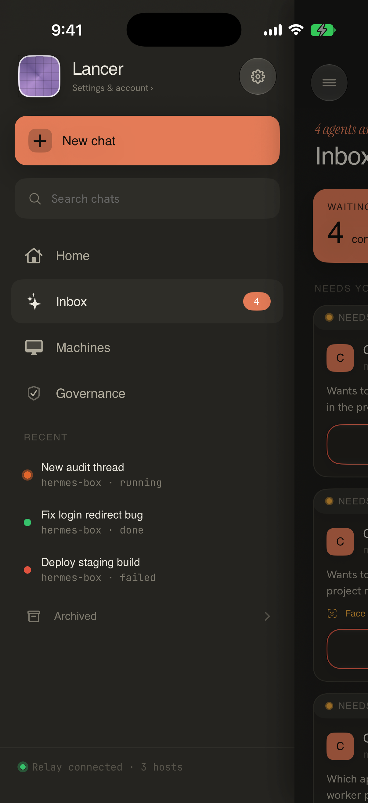
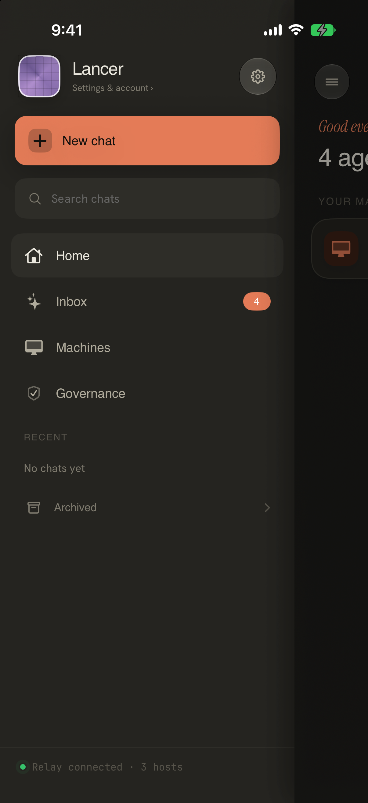

# Workflow 05: Machines

Status: **awaiting your approval** (doc-only; no SwiftUI implementation in this phase)  
Updated: 2026-06-30

## Current Screenshots

### Primary path (refreshed 2026-06-30, iPhone 17 Pro, dark)

### Related context

### Capture recipe

| State | Launch env | Notes |
| --- | --- | --- |
| Relay machine card | `LANCER_DESTINATION=machines` + `LANCER_FAKE_RELAY_HOST=hermes-box` | Shows relay host without live daemon |
| Empty fleet | `LANCER_DESTINATION=machines` on fresh install | Pair / connect empty state |
| SSH slot connected | Live `FleetStore` slot or future UITest seam | Not capturable with reseed alone |
| Offline / reconnect | Saved host without live slot | `reconnectableHosts` row — needs host DB seed |

**Not captured (gaps):**

- **Machine detail / diagnostics** — drill-in not screenshotted.
- **Contradictory state** — Home shows connected relay while composer says "No host" (WF03) — document as cross-surface inconsistency.
- **Pairing from Machines** — `onConnectHost` flow not re-captured this pass (see WF01).
- **Active run on machine row** — needs live slot with running session.

## Current Structure

Machines is the fleet and connection-health surface. It should explain what machines are paired, which are reachable, which agent/vendor paths are available, and what the user can do when something is unhealthy.

### Implementation map (corrected paths)

| Area | File |
| --- | --- |
| Machines UI | `Packages/LancerKit/Sources/AppFeature/FleetView.swift` |
| Connection state + slots | `Packages/LancerKit/Sources/AppFeature/FleetStore.swift` |
| Home machine tree | `Packages/LancerKit/Sources/AppFeature/LancerHomeView.swift` |
| Pairing entry | `Packages/LancerKit/Sources/AppFeature/BridgePairingView.swift` (and onboarding paths) |
| Host persistence | `Packages/LancerKit/Sources/PersistenceKit/HostRepository.swift` |
| Health / loop diagnostics | `HostHealthStore`, `LoopStore` (wired into `FleetView`) |

### What the code actually ships today

1. **Relay card** — when `relayActive`, shows `relayHostName` machine with agent labels and open-chat action (no `FleetStore` slot).
2. **SSH slots** — `store.slots` drive connected machine rows with bridge status, vendor spend summaries, terminal drill-in hooks.
3. **Reconnectable hosts** — saved hosts not in live slots appear as reconnect candidates.
4. **Demo hosts** — `demoHosts` fallback when repo empty (DEBUG risk if surfaced in production captures).
5. **Summary header** — fleet count and health derived from `FleetSummary(snapshots:)`.

## Current Issues

| Issue | Evidence | Severity |
| --- | --- | --- |
| **Split relay vs slot model** | Relay machine is a separate card path; SSH slots use `FleetStore` — status semantics differ | P1 — needs one `DSMachineStatus` vocabulary |
| **Home vs Machines duplication** | YOUR MACHINES on Home mirrors fleet list; sidebar has separate Machines root | P1 IA — acceptable if roles differ (glance vs manage) |
| **Fake relay ≠ live health** | `LANCER_FAKE_RELAY_HOST` shows connected UI without daemon proof | P2 debug seam — must not ship as production state |
| **Terminal drill-in on fleet** | `onOpenTerminal` opens block terminal — V1 must not surface interactive terminal in nav | P0 if exposed — verify guardrails |
| **Contradictory connection copy** | Sidebar footer hardcoded `Relay connected · 3 hosts` (WF02) while Machines shows actual seeded host | P0 trust |
| **Vendor spend on fleet** | `vendorSpend` rows — ensure not fake metrics in seeded builds | P1 trust |
| **Offline / error matrix** | Phone offline, daemon stopped, relay error — spec'd but not screenshot-verified | Doc gap |

## Mobbin / Pattern References

| Example | What it does well | Adapt for Lancer | Do not copy directly |
| --- | --- | --- | --- |
| Telegram device management | Lists connected devices with last active, platform, and management actions. | Use clear machine identity, last seen, and revoke/remove affordances. | Do not copy consumer messaging language. |
| Amazon Chime device/session management | Makes active sessions and device security manageable. | Useful for trusted-device framing and session revocation. | Do not make machine management feel like account security only. |
| Starlink network/device status | Separates online/offline hardware state from account state. | Use hardware-style connection health and recovery actions. | Do not copy consumer router visuals or map/network gimmicks. |
| Apple Home device lists | Groups devices by room/state with predictable controls. | Group machines by reachable/offline/setup if fleet grows. | Do not imply home automation or casual device control. |
| Google Home device/error states | Explains setup and unreachable devices in plain language. | Helpful for "machine unreachable" and setup recovery copy. | Do not copy bright consumer smart-home styling. |
| Tailscale devices | Shows device identity, connectivity, key/expiry, and last seen. | Strong model for developer-trusted machine rows. | Do not expose networking jargon unless needed for diagnostics. |
| Termius host list | Presents remote machines compactly for technical users. | Use dense host rows, status, and quick connect/reconnect affordances. | Do not turn Lancer into an SSH client. |
| Discord/monday/Squarespace workspace switchers | Handle multi-workspace identity and status clearly. | Useful for future multi-machine grouping and sidebar context. | Do not overcomplicate V1 if most users have one machine. |

### Fresh Mobbin Pass: 2026-06-30

Additional references reviewed:

- [Evernote connected devices](https://mobbin.com/screens/41138583-6e7a-400f-8eba-3e2410e2bdb9): useful for device identity plus management action.
- [Chime device/session list](https://mobbin.com/screens/4cb48df6-19b1-4b19-b3d3-2e2ab311b47b): useful for trusted-device security framing.
- [Coupang device list](https://mobbin.com/screens/547da641-9435-4f8d-ab54-ee6c643c0b9b): useful for simple paired-device rows.
- [Coupang Play device management](https://mobbin.com/screens/2aced98c-7221-4511-853b-0d5783767940): useful for keeping remove/revoke accessible but not prominent.
- [Starling Bank device security](https://mobbin.com/screens/1bc58d7a-4f88-429d-932e-0cda320ab24b): useful for trust and revocation copy.

Net update: Machines should read as trusted devices plus operational health. Put identity, last seen, state, and attention count in the row; move diagnostics and destructive actions into detail.

## Chosen Direction

**Scope:** Targeted redesign of fleet rows and detail — shared status component with Home; calm list, diagnostics in detail.

Machines should be a trusted-device list with operational health.

Each machine row should answer:

- Which machine is this?
- Is it reachable now?
- What agent/vendor capabilities are available?
- When was it last seen?
- What needs attention?
- What can I do next?

Use a detail view for diagnostics and destructive management actions. Keep the list calm and scannable.

## Proposed Screen Structure

1. Header:
   - Machine count and overall health.
   - Pair Machine action.

2. Machine list:
   - Machine name and icon.
   - Status: Connected, Active, Waiting, Offline, Pairing, Error.
   - Last seen and relay/daemon summary.
   - Active run or attention count if relevant.

3. Machine detail:
   - Identity: name, host, paired date, trust fingerprint if surfaced.
   - Health: phone-to-backend, backend-to-machine, daemon, push, relay.
   - Agents: installed/available vendors if product supports it.
   - Actions: rename, reconnect, diagnostics, remove/revoke.

4. Pairing entry:
   - Code-only V1 pairing.
   - Clear explanation of where to generate the setup code.

5. Diagnostics:
   - Plain-language status first.
   - Technical details behind disclosure.

## Required States

| State | Design requirement |
| --- | --- |
| No machines | Pair Machine as primary action with short explanation. |
| Pairing | Show code verification state and machine identity confirmation. |
| Connected idle | Calm connected state with last seen and available actions. |
| Active run | Surface active work and link to Work Thread. |
| Waiting approval | Surface attention count and Review action. |
| Machine offline | Last seen, likely causes, reconnect/diagnostics. |
| Phone offline | State that machine status is last known. |
| Daemon stopped | Explain local daemon needs to run; include command/help if supported. |
| Relay/backend error | Distinguish from local machine failure. |
| Auth revoked/unpaired | Show re-pair action and avoid stale controls. |
| Remove machine | Use destructive confirmation and explain consequence. |

## Designer Notes

- Hierarchy: machine identity and health first, diagnostics second.
- Spacing: rows should be compact enough for 3-5 machines without feeling like separate cards everywhere.
- Typography: machine name, short status, then last seen/technical metadata.
- Iconography: machine/device icons plus semantic status symbols.
- Motion: status changes should update calmly; avoid pulsing unless actively connecting.
- Accessibility: status labels must include text, not color alone.

## Implementation Notes

- `FleetStore.connectionState(for:)` should be the only source for rendered machine connection state.
- Extract `DSMachineStatus` or equivalent for Home and Machines — fix sidebar footer to use real counts.
- Remove or rewrite contradictory seeded/stub states.
- Keep pairing code-only and aligned with onboarding (WF01).
- Block `onOpenTerminal` from V1 navigation routes.
- Verify every machine state from `docs/V1_STATE_AND_ACTION_MATRIX.md` fixture cases.

## Approval Ask

Approve Machines as a trusted-device and health surface, with one canonical machine status row shared across Home and fleet views.
