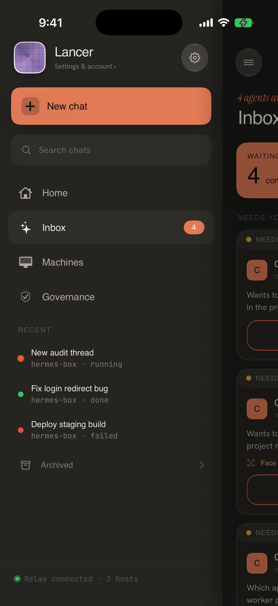

# Workflow 06: Settings

Status: **approved direction — native grouped settings** (doc/wireframe only; no SwiftUI implementation in this phase)  
Updated: 2026-07-05

## Locked Direction — 2026-07-05

Settings should be a **native grouped settings surface**, not an operations dashboard and not a marketing/paywall surface.

The key decision: Settings owns defaults and account/trust controls. Daily work, urgent approvals, machine recovery, and proof artifacts belong in Home, Workspaces, Work Thread, and Review.

The approved wireframe artifact is:

- [Core wireframe board — Settings](../lancer-core-wireframes-2026-07-05/index.html#settings)
- [Preview image](../lancer-core-wireframes-2026-07-05/preview.png)

### What Is Good About This Direction

- It is predictable: account, notifications, security, pairing, diagnostics, data, legal.
- It keeps the Cursor-like product surfaces simple by moving defaults and trust controls out of daily flows.
- It keeps safety controls separate from plan/billing state.
- It makes notification recovery easy to find without repeating onboarding.
- It gives provider keys, diagnostics, audit export, and destructive reset a home without making the main app feel technical.

### What Needs Care

- Governance should be defaults and audit export here, not a daily status dashboard.
- Billing/plan copy must only appear when production-ready and accurate.
- Provider keys and SSH keys are advanced, but still need a discoverable place.
- Terminal preferences should be hidden or reframed so V1 does not imply a phone IDE.
- Destructive reset/remove actions need native confirmation with concrete consequences.

### Mobbin Pass — 2026-07-05

| Example | What it does well | Adapt for Lancer | Do not copy directly |
| --- | --- | --- | --- |
| [MLS settings](https://mobbin.com/screens/5d8c6859-3a48-46a0-b27e-3373c9eb1b87) | Calm grouped settings with account and preference rows | Native grouped root structure | Consumer sports content |
| [Revolut settings](https://mobbin.com/screens/ff9a098a-d3c2-4a8f-bd86-8714c55af083) | Dense trust/account settings stay scannable | Security, trusted devices, and privacy grouping | Finance-app upsell weight |
| [Luma settings](https://mobbin.com/screens/7c388e5a-ce70-4a2b-9609-89705d72a01f) | Simple account/settings page with restrained chrome | Keep Lancer root settings quiet | Event/social app vocabulary |
| [Mercury security](https://mobbin.com/screens/60d9ab3c-a4d3-46f1-8799-a913ddcaafa7) | Security actions are clear and serious | Biometric, trusted machine, and audit controls | Banking-specific compliance tone |
| [Up security](https://mobbin.com/screens/8479be0c-6b89-4ebd-aef2-ef1a38576d5f) | Security settings are plain-language and grouped | Notification/security recovery states | Consumer banking styling |

**Net:** use standard grouped settings and restrained trust copy. Do not use Settings to sell, operate daily work, or duplicate Home/Review.

### Proposed Page Model

1. **Settings root** — account/local mode, appearance, notifications, security, pairing/trusted devices, diagnostics, data/legal.
2. **Security & approvals** — biometric, default autonomy, policy/audit log, trusted machines, provider keys.
3. **Notifications** — permission recovery, critical/high/medium/low severity defaults, quiet hours.
4. **Diagnostics** — relay, daemon, push, policy, support bundle.
5. **Data/legal** — audit export, privacy, terms, licenses, security architecture.

### What Stays From Lancer

| Capability | Settings treatment |
| --- | --- |
| Account/local mode | Root profile row with accurate state |
| Notifications | Root row plus detail page and denied-permission recovery |
| Security defaults | Security & approvals detail |
| Policy/governance | Defaults and audit export only; daily approvals stay in Review |
| Trusted machines | Root pairing row and Security detail |
| Provider/SSH keys | Advanced rows under Security or Developer section |
| Diagnostics | Read-only health and support bundle |
| Billing/plan | Only accurate production-ready state; never safety gating |
| Reset/destructive actions | Bottom section with native confirmation |

### Open Design Decision

Hide the current `Policy Bridge` hero from the Settings root. My recommendation: keep policy controls as rows under **Security & approvals**; the hero visually competes with Home and makes Settings feel like a governance dashboard.

## Superseded June 30 Direction

The June 30 direction below is mostly aligned in spirit, but the July 5 direction is stricter: Settings should be even more native, quieter, and less promotional.

## Current Screenshots

### Primary path (refreshed 2026-06-30, iPhone 17 Pro, dark)

### Related context

### Capture recipe

| State | Launch env | Notes |
| --- | --- | --- |
| Settings root | `LANCER_DESTINATION=settings` + optional reseed | Profile card shows plan line from `PurchaseManager` |
| Governance home | `LANCER_DESTINATION=governance` | Separate from Settings — policy audit stats |
| Offline / local account | Onboarding offline path + Settings | Profile: "Local pairing only · no hosted billing" |
| Notifications denied | Deny system prompt once, reopen Settings | Permission recovery row |
| Provider keys | Navigate from Settings grid | `ProviderKeysView` — developer-facing |

**Not captured (gaps):**

- **Pro / upgrade sheet** — `onShowLimits` paywall not screenshotted.
- **Biometric unavailable** — device-specific.
- **Destructive reset confirmation** — `showResetConfirmation` alert.
- **Light mode** — all captures dark.

## Current Structure

Settings should handle identity, safety defaults, notifications, machines/account controls, diagnostics, plan/account, and legal/support. It should not compete with Home as a daily operations surface.

### Implementation map (corrected paths)

| Area | File |
| --- | --- |
| Settings root | `Packages/LancerKit/Sources/SettingsFeature/SettingsView.swift` |
| Provider keys | `Packages/LancerKit/Sources/SettingsFeature/ProviderKeysView.swift` (via NavigationLink) |
| Governance home (separate root) | `Packages/LancerKit/Sources/AppFeature/GovernanceHomeView.swift` |
| Purchases / plan | `PurchaseManager.shared` via `@State purchases` in `SettingsView` |
| Account session | `AccountSessionController` — offline vs signed-in profile copy |
| Appearance | `@AppStorage(LancerAppearance.storageKey)` |

### What the code actually ships today

1. **Profile card** — name, plan line (`Free plan · upgrade` / `Lancer Pro · manage` / local-only copy), PRO/FREE badge.
2. **Grouped sections** — policy/governance link, general, terminal, connection, notifications, security, diagnostics, legal.
3. **Governance split** — `policyGovernanceSection` in Settings links policy; **Governance** is also a sidebar root with `GovernanceStats` dashboard — two entry points.
4. **Billing references** — privacy copy mentions RevenueCat, iCloud Pro sync; profile nudges upgrade when not Pro.
5. **Developer surfaces** — provider keys, terminal prefs, connection test — dense for a mobile settings page.

## Current Issues

| Issue | Evidence | Severity |
| --- | --- | --- |
| **Governance dual home** | Sidebar **Governance** root + Settings policy section + operational approvals on Home/Inbox | P1 IA — clarify defaults vs daily ops |
| **Plan copy in profile** | `Free plan · upgrade` / PRO badge driven by `PurchaseManager` — accurate only when billing is production-ready | P1 launch risk if entitlements stubbed |
| **iCloud Pro claims** | Privacy copy references iCloud CloudKit sync for Pro — must match shipped entitlements | P1 trust |
| **Safety vs monetization** | Upgrade affordance in profile header — must not gate security/approval defaults | P0 policy — safety never paywalled |
| **Terminal section in Settings** | Terminal preferences visible — V1 should not imply phone IDE | P1 scope |
| **Density** | Grid cards + many sections — calmer native grouped list preferred | P2 polish |
| **Notification denied recovery** | Reuse onboarding pattern — verify row exists with Settings deep link | P1 — partial from WF01 |

## Mobbin / Pattern References

| Example | What it does well | Adapt for Lancer | Do not copy directly |
| --- | --- | --- | --- |
| Apple Settings patterns | Predictable grouped lists, disclosure rows, and permission affordances. | Use grouped native structure for account, notifications, security, diagnostics, legal. | Do not make Settings visually custom just to look branded. |
| GitHub Mobile settings | Developer-facing settings stay utilitarian and organized. | Useful for account, notifications, security, and appearance grouping. | Do not copy GitHub-specific account/repo language. |
| Slack workspace/account settings | Separates workspace identity, notifications, and account controls. | Useful if Lancer needs machine/account boundaries. | Do not bring workspace complexity into V1 unnecessarily. |
| Tailscale settings/device preferences | Security and network settings remain technical but legible. | Good model for trusted machines, keys, and diagnostics. | Do not expose low-level networking by default. |
| Marcus security setup/settings | Security settings build confidence through clear verification. | Use for biometric, passcode, and trusted-device explanation. | Do not copy banking/legal heaviness. |
| Revolut security/approval settings | Makes risk controls understandable and auditable. | Useful for governance policy defaults and approval thresholds. | Do not make safety look like a paid financial feature. |
| QUITTR/Sunlitt/Hevy paywall patterns | Shows what polished subscription surfaces look like. | Borrow clarity of plan comparison only if monetization appears. | Do not block safety controls or over-market inside Settings. |
| Raycast settings/preferences | Technical product settings can be dense and clean. | Useful for diagnostics, vendor paths, and developer toggles. | Do not make mobile settings feel like desktop preferences. |

### Fresh Mobbin Pass: 2026-06-30

Additional references reviewed:

- [Shopee settings](https://mobbin.com/screens/9b70f0e8-058b-4952-9416-c432af6cab78): useful grouped settings baseline, though too marketplace-heavy for Lancer.
- [MLS settings](https://mobbin.com/screens/5d8c6859-3a48-46a0-b27e-3373c9eb1b87): useful for calm account/settings grouping.
- [Wise settings](https://mobbin.com/screens/d527ecba-5901-4855-b8d9-20fa2aed5702): strong model for professional account, security, and notification grouping.
- [Revolut settings](https://mobbin.com/screens/ff9a098a-d3c2-4a8f-bd86-8714c55af083): useful for dense trust-heavy settings, but avoid upsell weight.
- [NGL settings](https://mobbin.com/screens/ddf7e4ef-a654-4f2b-82c3-7b828b34d838): useful low-complexity grouped settings baseline.

Net update: Settings should stay native and grouped. Wise/Revolut are the strongest trust-heavy references, but Lancer should avoid finance-app upsell density and keep safety controls separate from plan state.

## Chosen Direction

**Scope:** Calm native grouped list — demote Governance sidebar root into Settings defaults; hide or soften billing until production-ready; keep safety always available.

Settings should be a native grouped settings surface with high-trust copy.

Recommended groups:

1. Account and identity.
2. Machines and pairing.
3. Notifications.
4. Security and approvals.
5. Appearance/accessibility if supported.
6. Diagnostics and support.
7. Plan/billing only if production-ready and accurate.
8. Legal/privacy.

Governance policy editing can live under Security and approvals, but daily approval state belongs in Home/Review, not Settings.

**IA note:** Consider removing **Governance** as a fourth sidebar root (per V1 four-root guardrail: Home, Work, Machines, Settings) and folding policy audit into Settings + Home metrics only when backed by real data.

## Proposed Screen Structure

1. Account header:
   - User name/account state.
   - Offline/local mode label if applicable.
   - Sign in/out action.

2. Machines:
   - Pair Machine.
   - Manage paired machines.

3. Notifications:
   - Approval alerts.
   - Run completion alerts.
   - Permission status and Settings deep link when denied.

4. Security and approvals:
   - Biometric confirmation.
   - Approval defaults.
   - Trusted devices.
   - Policy/audit settings if production-backed.

5. Diagnostics:
   - Connection test.
   - Export logs/audit.
   - Support bundle.

6. Plan and billing:
   - Include only accurate launch-ready plan state.
   - No DEBUG placeholders, fake trials, or unsupported hosted claims.

7. Legal:
   - Privacy, terms, licenses, security architecture if user-facing.

## Required States

| State | Design requirement |
| --- | --- |
| Signed out/local | Explain what works locally and what account adds. |
| Signed in | Show account identity and account actions. |
| Notifications denied | Show status, reason, and iOS Settings action. |
| Biometrics unavailable | Explain device limitation and fallback. |
| Offline | Disable network-only actions with explanation. |
| Billing unavailable | Hide production billing UI or label clearly as unavailable; do not show DEBUG. |
| Diagnostics running | Inline progress and result. |
| Export error | Show retry and where partial files were saved if applicable. |
| Destructive action | Native confirmation with concrete consequence. |

## Designer Notes

- Hierarchy: use standard grouped list sections. Settings is not a marketing page.
- Spacing: native grouped list spacing is acceptable; avoid custom card stacks.
- Typography: clear section headers and concise secondary text.
- Iconography: SF Symbols for sections, consistent size and weight.
- Motion: native disclosure and sheet transitions only.
- Accessibility: settings rows must have complete labels and values; toggles need descriptive labels.

## Implementation Notes

- Remove or rewrite prototype billing/trust copy before launch.
- Keep safety settings available regardless of plan.
- Consolidate governance/policy settings so Home/Review handles daily operational state and Settings handles defaults.
- Reuse notification permission state components from onboarding (WF01).
- Verify light/dark mode, dynamic type, local/offline account, denied notification, and destructive confirmations.

## Approval Ask

Approve Settings as a native grouped control surface focused on identity, pairing, notifications, security defaults, diagnostics, and accurate plan/legal information — with Governance demoted from a competing sidebar root.
