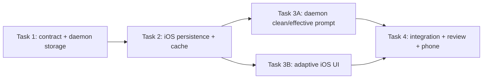

# Structured Attachment Messages Implementation Plan

> **For agentic workers:** REQUIRED SUB-SKILL: Use superpowers:subagent-driven-development or superpowers:executing-plans task-by-task. Every behavior change follows RED → GREEN.

**Goal:** Show actual sent images and clean file cards in chat, persist them across relaunches, and keep absolute host paths out of all user-facing text.

**Architecture:** Add one backward-compatible attachment contract shared by Swift and Go. Persist clean prompts plus attachment metadata, build the vendor-only path prefix in `lancerd`, cache bounded previews on the phone, and render one shared attachment-aware user-message component in live and historical transcripts.

**Tech Stack:** Swift 6, SwiftUI, GRDB, Foundation image cache, Go, SQLite, JSON relay RPC.

## Global constraints

- Workspaces remains the only root; do not restore legacy chat/review shells.
- Do not change `daemon/lancerd/dispatch.go`; vendor adapter changes require a separate audit.
- Internal `hostPath` is transport-only and must not appear in UI, titles, accessibility labels, analytics, or user-facing errors.
- Existing requests and historical turns without attachments must decode unchanged.
- Existing prefixed historical prompts display cleanly but do not fabricate unavailable images.
- Preview generation is bounded, asynchronous, and non-blocking; failed previews degrade to file cards.
- `Package.resolved` must remain unchanged.
- Parallel workers must have distinct write sets and separate worktrees.

---

### Task 1: Shared wire contract and daemon turn persistence

**Files:**
- Modify: `Packages/LancerKit/Sources/LancerCore/LancerDProtocol.swift`
- Modify: `daemon/lancerd/conversation_store.go`
- Modify: `daemon/lancerd/conversation_store_test.go`
- Modify: `daemon/lancerd/conversation_rpc_test.go`
- Test: `Packages/LancerKit/Tests/LancerKitTests/LancerDProtocolTests.swift`

**Interfaces:**
- Produces: `ConversationAttachmentReference`
- Produces: `ConversationAppendRequest.attachments: [ConversationAttachmentReference]?`
- Produces: `ConversationTurnEnvelope.attachments: [ConversationAttachmentReference]`
- Produces Go equivalent `conversationAttachmentReference`
- Persists: `conversation_turns.attachments_json TEXT NOT NULL DEFAULT '[]'`

- [ ] **Step 1: Write failing compatibility and round-trip tests**

```swift
@Test func conversationTurnDecodesWhenAttachmentsAreAbsent() throws {
    let data = Data(#"{"id":"t1","conversationId":"c1","ordinal":1,"clientTurnId":"ct1","prompt":"hello","runId":"r1","provider":"claudeCode","status":"completed","startedAt":"2026-07-14T00:00:00Z"}"#.utf8)
    let turn = try JSONDecoder().decode(ConversationTurnEnvelope.self, from: data)
    #expect(turn.attachments.isEmpty)
}

@Test func conversationAttachmentRoundTrips() throws {
    let ref = ConversationAttachmentReference(
        id: "a1", name: "photo.jpg", mimeType: "image/jpeg",
        byteCount: 310_992, kind: .image,
        hostPath: "/Users/me/.lancer/attachments/photo.jpg",
        previewCacheKey: "a1"
    )
    #expect(try JSONDecoder().decode(
        ConversationAttachmentReference.self,
        from: JSONEncoder().encode(ref)
    ) == ref)
}
```

Add a Go store test that appends one turn with attachment metadata, reopens the SQLite store, fetches the turn, and compares every attachment field.

- [ ] **Step 2: Run RED**

Run:

```bash
cd Packages/LancerKit
swift test --filter "conversationTurnDecodesWhenAttachmentsAreAbsent|conversationAttachmentRoundTrips"
cd ../../../daemon/lancerd
go test ./... -run 'TestConversation.*Attachment'
```

Expected: compile/test failure because attachment types and persisted fields do not exist.

- [ ] **Step 3: Implement the additive contract**

```swift
public struct ConversationAttachmentReference: Codable, Sendable, Hashable, Identifiable {
    public enum Kind: String, Codable, Sendable { case image, file }
    public let id: String
    public let name: String
    public let mimeType: String?
    public let byteCount: Int
    public let kind: Kind
    public let hostPath: String
    public let previewCacheKey: String
}
```

Decode missing turn attachments as `[]`. Add the equivalent Go JSON type and an idempotent SQLite migration for `attachments_json`. Update every turn insert/select path, including observed-import inserts, to use `[]` when metadata is absent.

- [ ] **Step 4: Run GREEN and compatibility suites**

```bash
cd Packages/LancerKit
swift test --filter LancerDProtocol
cd ../../../daemon/lancerd
go test ./... -run 'TestConversation'
go test ./...
```

Expected: all selected and full Go tests pass.

- [ ] **Step 5: Commit**

```bash
git add Packages/LancerKit/Sources/LancerCore/LancerDProtocol.swift \
  Packages/LancerKit/Tests/LancerKitTests/LancerDProtocolTests.swift \
  daemon/lancerd/conversation_store.go \
  daemon/lancerd/conversation_store_test.go \
  daemon/lancerd/conversation_rpc_test.go
git commit -m "feat(attachments): persist conversation attachment metadata"
```

---

### Task 2: Phone persistence and bounded preview cache

**Files:**
- Create: `Packages/LancerKit/Sources/AppFeature/Context/AttachmentPreviewCache.swift`
- Modify: `Packages/LancerKit/Sources/LancerCore/ChatConversation.swift`
- Modify: `Packages/LancerKit/Sources/PersistenceKit/ChatConversationRepository.swift`
- Modify: `Packages/LancerKit/Sources/AppFeature/ConversationSyncCoordinator.swift`
- Modify: `Packages/LancerKit/Sources/AppFeature/Context/AttachmentModels.swift`
- Test: `Packages/LancerKit/Tests/LancerKitTests/AttachmentModelsTests.swift`
- Test: `Packages/LancerKit/Tests/LancerKitTests/ChatConversationRepositoryTests.swift`
- Test: `Packages/LancerKit/Tests/LancerKitTests/ConversationSyncCoordinatorTests.swift`

**Interfaces:**
- Consumes: `ConversationAttachmentReference`
- Produces: `ChatTurn.attachments: [ConversationAttachmentReference]`
- Produces: `AttachmentPreviewCaching.storePreview(_:for:)` and `previewData(for:)`
- Produces: `AttachmentDraft.reference(hostPath:mimeType:)`

- [ ] **Step 1: Write failing persistence/cache tests**

```swift
@Test func chatTurnAttachmentsSurviveRepositoryReopen() async throws {
    // Insert a turn containing one image reference, reopen the database,
    // and assert the fetched turn contains the identical reference.
}

@Test func previewCacheSurvivesRecreation() throws {
    let directory = temporaryDirectory()
    try AttachmentPreviewCache(directory: directory).storePreview(Data("preview".utf8), for: "a1")
    #expect(try AttachmentPreviewCache(directory: directory).previewData(for: "a1") == Data("preview".utf8))
}
```

Add a coordinator test proving host attachment envelopes map into local `ChatTurn.attachments`.

- [ ] **Step 2: Run RED**

```bash
cd Packages/LancerKit
swift test --filter 'AttachmentModelsTests|ChatConversationRepositoryTests|ConversationSyncCoordinatorTests'
```

Expected: failures for missing attachment persistence/cache APIs.

- [ ] **Step 3: Implement persistence and cache**

Add an `attachments_json` column to local `chat_turns`, defaulting to `[]`. Store previews under Application Support using sanitized cache keys and atomic writes. Keep image decoding/downscaling in an iOS-only helper, but keep cache I/O Foundation-only for package tests.

Extend drafts with MIME type and a stable reference:

```swift
public func reference(hostPath: String, mimeType: String?) -> ConversationAttachmentReference {
    .init(
        id: id.uuidString, name: name, mimeType: mimeType,
        byteCount: totalBytes, kind: mimeType?.hasPrefix("image/") == true ? .image : .file,
        hostPath: hostPath, previewCacheKey: id.uuidString
    )
}
```

- [ ] **Step 4: Run GREEN**

```bash
cd Packages/LancerKit
swift test --filter 'AttachmentModelsTests|ChatConversationRepositoryTests|ConversationSyncCoordinatorTests'
swift build
```

Expected: affected suites and build pass.

- [ ] **Step 5: Commit**

```bash
git add Packages/LancerKit/Sources/AppFeature/Context/AttachmentPreviewCache.swift \
  Packages/LancerKit/Sources/AppFeature/Context/AttachmentModels.swift \
  Packages/LancerKit/Sources/AppFeature/ConversationSyncCoordinator.swift \
  Packages/LancerKit/Sources/LancerCore/ChatConversation.swift \
  Packages/LancerKit/Sources/PersistenceKit/ChatConversationRepository.swift \
  Packages/LancerKit/Tests/LancerKitTests
git commit -m "feat(ios): persist attachment previews with chat turns"
```

---

### Task 3A: Daemon clean-prompt dispatch

**Parallel with Task 3B after Tasks 1–2 are integrated.**

**Files:**
- Modify: `daemon/lancerd/conversation_rpc.go`
- Modify: `daemon/lancerd/conversation_store.go`
- Modify: `daemon/lancerd/conversation_rpc_test.go`
- Modify: `daemon/lancerd/dispatch_conversation_test.go`

**Interfaces:**
- Consumes: `conversationAppendRequest.Attachments`
- Produces: `effectiveAttachmentPrompt(cleanPrompt, attachments) string`
- Guarantee: store/title use clean prompt; `conversationLaunchParams.Prompt` receives effective prompt.

- [ ] **Step 1: Write failing clean/effective prompt tests**

```go
func TestAttachmentAppendStoresCleanPromptAndDispatchesEffectivePrompt(t *testing.T) {
    // Append prompt "Describe this image" with one attachment.
    // Assert fetched turn prompt and derived title contain only clean text.
    // Assert captured launch prompt contains the host path then clean text.
}
```

- [ ] **Step 2: Run RED**

```bash
cd daemon/lancerd
go test ./... -run 'TestAttachmentAppendStoresCleanPrompt'
```

Expected: launch and stored prompts are currently identical.

- [ ] **Step 3: Implement minimal daemon separation**

Keep `req.Prompt` clean for append/store. Build only the launch prompt:

```go
launchParams.Prompt = effectiveAttachmentPrompt(req.Prompt, req.Attachments)
```

Ignore empty host paths, preserve attachment order, and never log the generated prefix.

- [ ] **Step 4: Run GREEN**

```bash
cd daemon/lancerd
go test ./... -run 'TestAttachment|TestConversation'
go test ./...
```

- [ ] **Step 5: Commit**

```bash
git add daemon/lancerd/conversation_rpc.go \
  daemon/lancerd/conversation_store.go \
  daemon/lancerd/conversation_rpc_test.go \
  daemon/lancerd/dispatch_conversation_test.go
git commit -m "fix(daemon): separate attachment transport from chat prompts"
```

---

### Task 3B: Adaptive attachment composer and transcript UI

**Parallel with Task 3A after Tasks 1–2 are integrated.**

**Files:**
- Create: `Packages/LancerKit/Sources/AppFeature/Chat/ChatAttachmentStrip.swift`
- Create: `Packages/LancerKit/Sources/AppFeature/Chat/AttachmentPreviewView.swift`
- Modify: `Packages/LancerKit/Sources/AppFeature/Chat/ChatThreadChrome.swift`
- Modify: `Packages/LancerKit/Sources/AppFeature/Chat/LiveThreadView.swift`
- Modify: `Packages/LancerKit/Sources/AppFeature/Workspaces/ThreadDetailView.swift`
- Modify: `Packages/LancerKit/Sources/AppFeature/Composer/NewChatComposerView.swift`
- Modify: `Packages/LancerKit/Sources/AppFeature/Context/ContextAttachView.swift`
- Modify: `Packages/LancerKit/Sources/AppFeature/Context/AttachmentModels.swift`
- Test: `Packages/LancerKit/Tests/LancerKitTests/AttachmentModelsTests.swift`
- Test: `LancerUITests/LegacyUIRemovalTests.swift`

**Interfaces:**
- Consumes: `ChatTurn.attachments`
- Consumes: `AttachmentPreviewCaching`
- Produces: `AttachmentLayoutPolicy.columns(for:)`
- Produces: attachment-aware `ChatUserBubble(text:attachments:)`

- [ ] **Step 1: Write failing display-policy and sanitization tests**

```swift
@Test func attachmentLayoutIsAdaptive() {
    #expect(AttachmentLayoutPolicy.columns(for: 1) == 1)
    #expect(AttachmentLayoutPolicy.columns(for: 2) == 2)
    #expect(AttachmentLayoutPolicy.columns(for: 5) == 2)
}

@Test func legacyAttachmentPrefixIsHiddenFromDisplay() {
    let prompt = "Attached files (read from disk):\n- /Users/me/.lancer/attachments/photo.jpg\n\nDescribe it"
    #expect(AttachmentDisplayText.cleanPrompt(prompt) == "Describe it")
}
```

- [ ] **Step 2: Run RED**

```bash
cd Packages/LancerKit
swift test --filter AttachmentModelsTests
```

Expected: missing layout/sanitization APIs.

- [ ] **Step 3: Implement adaptive rendering**

Use one prominent rounded preview for one image and a two-column lazy grid for multiple images. Render non-image attachments as filename/type/size cards. Tap image previews into a system full-screen cover. Use `.accessibilityLabel("Attached image, \(name), \(size)")`.

Generate/cache the bounded preview before dispatch while draft bytes are available. Send the clean prompt plus structured references; remove `AttachmentPromptPrefix.apply` from both new-chat and follow-up send paths.

Historical legacy prompts use `AttachmentDisplayText.cleanPrompt`; they show clean file cards when names can be parsed, without pretending cached bytes exist.

- [ ] **Step 4: Run GREEN and app-target checks**

```bash
cd Packages/LancerKit
swift test --filter AttachmentModelsTests
swift build
cd ../../..
xcodebuild -project Lancer.xcodeproj -scheme Lancer \
  -destination 'platform=iOS Simulator,name=iPhone 17 Pro' build
```

Run focused UI coverage for composer disabled/enabled send behavior and capture screenshots for one image, multiple images, file-only, and missing-preview fallback.

- [ ] **Step 5: Commit**

```bash
git add Packages/LancerKit/Sources/AppFeature/Chat \
  Packages/LancerKit/Sources/AppFeature/Composer/NewChatComposerView.swift \
  Packages/LancerKit/Sources/AppFeature/Context \
  Packages/LancerKit/Sources/AppFeature/Workspaces/ThreadDetailView.swift \
  Packages/LancerKit/Tests/LancerKitTests/AttachmentModelsTests.swift \
  LancerUITests/LegacyUIRemovalTests.swift
git commit -m "feat(ios): render structured attachments in chat"
```

---

### Task 4: Integration, review, and device proof

**Files:**
- Modify only conflict resolutions required by Tasks 1–3.
- Update: `docs/test-runs/2026-07-14-beta-simulator-pass.md`

- [ ] **Step 1: Integrate in dependency order**

Integrate Tasks 1 and 2 first. Rebase Tasks 3A and 3B onto that exact integration SHA, then run them in parallel. Merge by commit/diff, never whole-file copy.

- [ ] **Step 2: Run authoritative gates**

```bash
cd Packages/LancerKit
swift build
swift test
cd ../../daemon/lancerd
go test ./...
cd ../..
xcodebuild -project Lancer.xcodeproj -scheme Lancer \
  -destination 'platform=iOS Simulator,name=iPhone 17 Pro' build
xcodebuild test -project Lancer.xcodeproj -scheme Lancer \
  -destination 'platform=iOS Simulator,name=iPhone 17 Pro' \
  -only-testing:LancerUITests -parallel-testing-enabled NO
git diff --check
git diff -- Packages/LancerKit/Package.resolved
```

- [ ] **Step 3: Independent review**

Run a fresh Grok review with a dependents map for every changed public symbol. Blocking/major findings receive one bounded correction and one re-review. Review must explicitly check path leakage, SQLite migration compatibility, cache traversal, memory bounds, accessibility, and daemon prompt separation.

- [ ] **Step 4: Physical-phone acceptance**

Upgrade-install without uninstalling. Send one image and two images, reopen each thread, tap full-screen, verify clean prompt/title, and confirm the host receives valid paths. Test one PDF/file fallback. Record screenshots and elapsed upload/dispatch timing.

- [ ] **Step 5: Release evidence**

Update the beta report with exact integrated SHA, commands, counts, screenshots, and remaining vendor-native image-latency follow-up. Do not claim the separate latency optimization is complete.

## Execution DAG



## Plan self-review

- Every requirement in `docs/plans/2026-07-14-attachment-message-design.md` maps to a task.
- Parallel Tasks 3A/3B have disjoint write sets.
- Swift/Go type names and JSON field names are consistent across tasks.
- No placeholder steps remain; every code change has an explicit RED/GREEN command.
