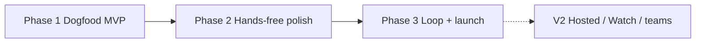

# Lancer daily-driver roadmap — 2026-07-19

**Status:** Detail annex to [`docs/SHIP_PLAN.md`](../SHIP_PLAN.md) (owner SSOT, 2026-07-19) — decisions and gates live there; phase/task detail lives here. Note: SHIP_PLAN locks iOS 27 all-in with deep Siri as a core GA feature, pulling Siri forward from this doc's Phase 3.  
**Authority:** [`docs/product/2026-07-10-lancer-daily-driver-definition.md`](../product/2026-07-10-lancer-daily-driver-definition.md)  
**Build how-to:** [`docs/product/2026-07-10-lancer-agent-build-roadmap.md`](../product/2026-07-10-lancer-agent-build-roadmap.md)  
**Wireframes:** [`docs/design/2026-07-19-away-mode-wireframes/index.html`](../design/2026-07-19-away-mode-wireframes/index.html)

## Thesis (locked)

**Front door:** drive / unblock agents on *your* machines from the phone (chat + push + continue).  
**Substrate (not the homepage):** approvals that bind, emergency stop, audit — so Away Mode is trustworthy.  
**Success metric:** owner completes real work through Lancer 5 days of 7 without reaching for the laptop.

Do **not** lead with policy-matrix marketing. Do **not** chase Orca desktop IDE depth or Happier multi-platform breadth until the phone loop is boringly reliable.

---

## Phase map

| Phase | Goal | Exit bar |
|---|---|---|
| **1 — Dogfood MVP** | Core loop on physical phone | Pair → dispatch → approve → follow-up, 5/7 days; dogfood log active |
| **2 — Hands-free** | Act without babysitting the app | Lock-screen + Live Activity in daily use; receipt glance; Siri Phase 1 dogfood |
| **3 — Loop + launch** | Supervise loops; App Store readiness | Mid-Aug dogfood go/no-go; iOS 27 prep; TestFlight → GA decision |
| **V2** | Hosted cloud, Watch polish, teams | Only after fork decision |

---

## Phase 1 — Dogfood MVP (NOW)

### Must ship / prove

| ID | Work | Status today | Notes |
|---|---|---|---|
| P1.1 | Pairing + trusted machines | ✅ | Re-prove after sim/phone slot conflicts |
| P1.2 | Composer → dispatch (repo/agent/model) | 🔶 | Add **machine picker** when >1 host |
| P1.3 | Live thread + follow-up continue | ✅ sim / 🔶 device | Chat finesse per port-map (streaming, tools) |
| P1.4 | Inline approval + question cards | ✅ | Keep; don't rebuild |
| P1.5 | **Needs-You on Workspaces home** | 🔶/❌ | Banner on some tips; **global hub + ingest beyond open thread** still required |
| P1.6 | Needs-you-first thread ordering | ❌ | List is recency-only today |
| P1.7 | Push + lock-screen approve on tip | 🔶 | Code exists; device re-proof is the gate |
| P1.8 | Emergency stop usable from phone | 🔶 | UI exists; harness flaky; prove on device |
| P1.9 | Agents section honesty | 🔶 | Kill false "unreachable" while dispatch works |
| P1.10 | Dogfood log discipline | 🔶 | File exists; sparse after 07-14 |

### Explicitly out of Phase 1

Policy editor cathedral · audit Settings polish · Siri deep work · Watch · Proof Reel · PR merge · Away Launch contract chips · hosted cloud.

---

## Phase 2 — Hands-free + trust surfaces

| ID | Work | Status |
|---|---|---|
| P2.1 | Live Activities on **relay** path + widget extension | 🔶 partial |
| P2.2 | Receipt / “what happened” glance card | ✅ code / polish |
| P2.3 | Siri Phase 1 dogfood (status, deny, pause/stop, answer) — **no approve** | 🔶 |
| P2.4 | Context/budget ring on thread | ❌ |
| P2.5 | Notify-then-re-read push hygiene | 🔶 |
| P2.6 | Return-to-desk thin packet (optional) | ❌ |

---

## Phase 3 — Loop supervision + launch (Aug→Sept)

| ID | Work |
|---|---|
| P3.1 | Observed / Ralph-style loop awareness (iteration, criteria, budget on thread row) |
| P3.2 | Swarm overview (visual lanes — agent → package → needs-you) |
| P3.3 | PR read + comment + “ask agent to fix” (merge gated / maybe never) |
| P3.4 | iOS 27 deep Siri packages (LongRunningIntent dispatch only) |
| P3.5 | App Store / TestFlight launch packages — mid-Aug dogfood is go/no-go |

---

## V2 (frozen until fork)

Hosted-cloud execution UI · Watch as primary surface · team/billing · open-sourcing `lancerd` as the growth bet.

---

## Competitive posture (reminders)

| Competitor | Don’t try to beat them at | Beat them at |
|---|---|---|
| Orca | Desktop IDE / worktree fan-out | Phone as primary away control |
| lfg | PWA + Tailscale folklore + skip-permissions speed | Native loop + bound approvals + own-stack fidelity |
| Happier | Platform breadth / E2EE chat polish | Daily-driver reliability on iOS + OpenCode-class stack |
| Omnara | Cloud Claude Q&A | Own machines, multi-vendor including OpenCode |

---

## Wireframe set (net-new / incomplete)

See [`../design/2026-07-19-away-mode-wireframes/index.html`](../design/2026-07-19-away-mode-wireframes/index.html):

1. Workspaces home + Needs-You banner  
2. Needs-You hub  
3. Threads — needs-you-first  
4. Composer — machine picker  
5. Lock screen + Live Activity  
6. Receipt / away digest glance  
7. Emergency stop confirm  

---

## Immediate next actions (ordered)

1. Rebase/integrate tip so home Needs-You banner + relay audit/stop aren’t tip-drift casualties.  
2. Device re-proof: push while closed → lock-screen decide → agent resumes (`LIVE_LOOP_RUNBOOK.md`).  
3. Global Needs-You hub + thread needs-you ordering (wireframes 1–3).  
4. Machine picker when fleet > 1.  
5. Start daily dogfood log again — each laptop-reach is a ticket.
