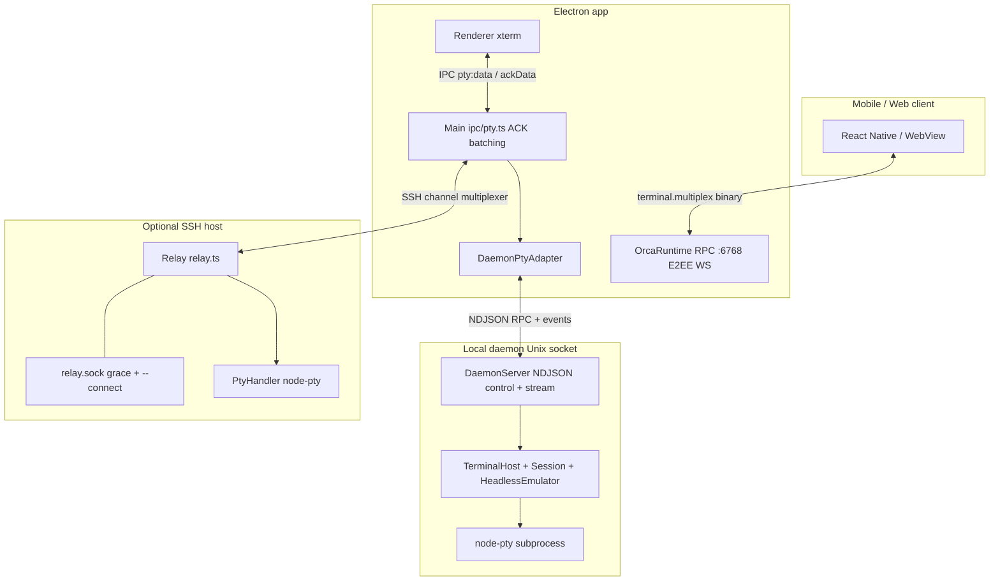

Starting a read-only pass on the Orca repo: mapping layout and tracing terminal/PTY code paths end-to-end.
# Orca Terminal Architecture — Research Report (R1)

Read-only analysis of `research-repos/orca` for Lancer’s lancerd-hosted PTY over an E2E relay WebSocket. Evidence is from the cloned repo; gaps are called out explicitly.

---

## Executive summary

Orca is a **three-tier terminal stack**:

1. **PTY host** — long-lived **daemon** (`src/main/daemon/`) or **SSH relay** (`src/relay/pty-handler.ts`) runs `node-pty` and keeps sessions alive across app restarts.
2. **Desktop bridge** — Electron **main process** (`src/main/ipc/pty.ts`) batches output, ACK-gates renderer delivery, and maintains a **headless xterm emulator** for recovery.
3. **Clients** — desktop renderer (xterm + WebGL), **mobile** (WebSocket RPC + binary terminal stream on port **6768**), and **SSH remote** (framed JSON-RPC over one SSH exec channel).

For Lancer: the closest analogue is **OrcaRuntime mobile path** — E2EE WebSocket, `terminal.subscribe` / `terminal.multiplex`, binary `terminal-stream-protocol` frames — not the local Unix-socket daemon path (which is same-machine only).

---

## 1. Where does the PTY/process run?

### Local (default desktop)

| Layer | Location | Evidence |
|--------|-----------|----------|
| **Preferred** | Out-of-process **daemon** (`daemon-entry.js` → `DaemonServer` + `TerminalHost`) | `src/main/daemon/daemon-init.ts` forks daemon, swaps `DaemonPtyAdapter` in via `setLocalPtyProvider()` |
| **PTY spawn** | Daemon calls `node-pty` in `pty-subprocess.ts` | `import * as pty from 'node-pty'`; `SubprocessHandle` wired into `Session` |
| **Fallback** | In-process `LocalPtyProvider` when daemon unhealthy / degraded | `degraded-daemon-pty-provider.ts` routes **new** spawns to local; `local-pty-provider.ts` `acknowledgeDataEvent` is no-op |
| **Headless state** | Per-session `HeadlessEmulator` in daemon `Session` | `session.ts` — emulator mirrors PTY for snapshots/checkpoints; does **not** reply to terminal queries |

PTY **never runs in the renderer**. Renderer is a view; main/daemon own process + scrollback model (`docs/terminal-main-owned-state.md`).

### SSH remote

| Layer | Location | Evidence |
|--------|-----------|----------|
| **Relay process** | `src/relay/relay.ts` deployed to remote host | Comment: “lightweight daemon… stdin/stdout framed JSON-RPC”; PTYs in `PtyHandler` |
| **PTY** | `node-pty` inside relay | `pty-handler.ts` dynamic `import('node-pty')` |
| **Persistence** | Relay **grace period** + Unix socket `--connect` | `relay.ts` lines 17–20, 153–158: client disconnect → PTYs kept; new SSH bridges to same relay |

### Mobile

Mobile does **not** host PTY. It connects to desktop **OrcaRuntime** WebSocket (`mobile/README.md`: port `6768`). Desktop’s existing PTY (daemon or SSH) is subscribed via `terminal.subscribe`.

**Could not determine:** whether Orca mobile ever runs PTY on-device in production (README implies desktop-hosted only).

---

## 2. Transport: bytes, framing, multiplexing

Orca uses **different transports per hop**; all are **multiplexed** on existing connections (no separate SSH channel per pane for terminal data on the remote path).

### A. Daemon ↔ Electron main (local)

**Two Unix domain sockets per client** (`daemon/client.ts`):

- **Control**: NDJSON RPC (`encodeNdjson` / `createNdjsonParser`) — `createOrAttach`, `write`, `resize`, `takePendingOutput`, etc. (`src/main/daemon/types.ts`, `PROTOCOL_VERSION = 18`)
- **Stream**: NDJSON **events** — `{ type: 'event', event: 'data'|'exit', sessionId, payload }` (`daemon-server.ts`)

PTY payload on the wire is **UTF-8 text strings** inside JSON (not raw binary). `DaemonStreamDataBatcher` coalesces at **8 ms**, merges same-session chunks, splits lines to respect `NDJSON_MAX_LINE_BYTES` (`daemon-stream-data-batcher.ts`).

**Interactive bypass:** within **100 ms** of input, outputs ≤ **1024 chars** flush immediately (`daemon-server.ts` `INTERACTIVE_OUTPUT_*`).

### B. Main ↔ renderer (local)

**Electron IPC**: `pty:data` notifications with batched strings; renderer **`pty:ackData`** (`preload/index.ts`, `ipc/pty.ts`).

### C. SSH relay ↔ desktop

**13-byte header** + JSON-RPC payload (`src/relay/protocol.ts`):

```
[type:1][seq:4 BE][ack:4 BE][length:4 BE][payload]
```

- `MessageType`: Regular (1), Handshake (2), KeepAlive (9)
- Seq/ack on every frame; `SshChannelMultiplexer` tracks unacked outbound (`ssh-channel-multiplexer.ts`)
- PTY: RPC `pty.spawn`, `pty.attach`, notifications `pty.data`, `pty.replay`, `pty.exit`; fire-and-forget `pty.resize`, `pty.data` (input)

**One SSH exec channel** carries filesystem, git, PTY, workspace session, agent hooks, etc.

### D. Desktop runtime ↔ mobile / web remote

**WebSocket** on `6768` (`runtime-rpc.ts`, `ws-transport.ts`):

1. **E2EE handshake** (`e2ee-channel.ts`): `e2ee_hello` / `e2ee_auth` + device token; JSON and **binary** replies encrypted (`encrypt` / `encryptBytes`)
2. **JSON streaming RPC**: `terminal.subscribe` (legacy) or **`terminal.multiplex`** (one stream, many `streamId`s) — `terminal.ts`
3. **Binary terminal frames** (`terminal-stream-protocol.ts`): 16-byte header (`0x74` kind, version, opcode, `streamId`, 64-bit `seq`) + payload. Opcodes: Output, SnapshotStart/Chunk/End, Resized, Input, Subscribe, etc.

Mobile **requires** binary stream (`binary_terminal_stream_required` if missing) — `terminal.ts` ~1751–1753.

**Compression:** No terminal-path gzip/deflate found. Bounded via batching and byte budgets, not compression.

**Note:** `binary-frame.ts` (5-byte daemon↔subprocess framing) exists with tests only — **not imported by production daemon code** (only `binary-frame.test.ts`). Subprocess uses in-process `node-pty` callbacks, not a separate framed subprocess channel.

---

## 3. Reconnect / resume / scrollback

Orca has **three distinct recovery modes**:

### Warm reattach (PTY still alive)

| Path | Behavior |
|------|----------|
| **Daemon** | `createOrAttach` on live session → returns `snapshot` (rehydrate + viewport ANSI) + continues streaming (`terminal-host.ts`, `daemon-pty-adapter.ts`) |
| **SSH relay** | `pty.attach` → **`replay` last 100 KB** (`REPLAY_BUFFER_MAX`) via `pty.replay` notification or RPC return (`pty-handler.ts` 685–751). Buffer **not cleared** after replay so later reconnects still get full tail |
| **Renderer** | Clears xterm, writes replay/snapshot under **replay guard** + seq dedup (`docs/terminal-main-owned-state.md`, `replay-guard.ts`) |

### Client disconnect (SSH)

Relay enters **grace period** (default from `DEFAULT_SSH_RELAY_GRACE_PERIOD_SECONDS`); PTYs keep running. Reconnect: `relay.js --connect` bridges new SSH stdio to existing Unix socket (`relay.ts`).

### Cold restore (PTY dead, unclean shutdown)

| Mechanism | Details |
|-----------|---------|
| **On-disk history** | `~userData/terminal-history/<sessionId>/`: `meta.json`, `checkpoint.json`, incremental `output.log` (`history-manager.ts`, `history-reader.ts`) |
| **Checkpoint cadence** | Incremental `takePendingOutput` every ~5s; full snapshot on overflow, log cap (**5 MB**), or clean disconnect |
| **Sequence numbers** | `pendingOutputSeq` per session; log batches store `seq`; **gap detection discards log** and falls back to checkpoint (`types.ts` `TakePendingOutputResult` comments, `history-reader.ts`) |
| **Cold restore payload** | `detectColdRestore` replays log through scratch `HeadlessEmulator`; returns scrollback + modes + cwd (`daemon-pty-adapter.ts` 246–276) |
| **ACK for cold restore** | `pty:ackColdRestore` clears daemon adapter sticky cache (`ipc/pty.ts`) |

### In-flight output while disconnected

- **Daemon stream socket**: if no client, `DaemonStreamDataBatcher.enqueue` **drops** when `streamSocket` missing (`daemon-stream-data-batcher.ts` 119–122) — bytes still go to headless emulator + pending records for checkpoint.
- **SSH relay**: continues buffering last 100 KB in `managed.buffered`; live `pty.data` may be batched in `pendingOutputByPty`.
- **Main→renderer**: if renderer slow/gone, `pendingData` capped at **2 MB**; overflow sets `droppedBacklog` and recovery from **main headless snapshot** (`ipc/pty.ts`, `terminal-main-owned-state.md`).

**Gap detection:** Explicit on daemon history log (`seq`); SSH replay buffer is **tail-only, no seq on wire** for `pty.data` notifications (could not find seq-based gap detection on SSH PTY stream).

---

## 4. Backpressure / flow control

### Renderer ACK gate (production, local + SSH client side)

`ipc/pty.ts`:

- Renderer calls `ackPtyData` → `pty:ackData` after xterm parses chunks (`terminal-pty-ack-gate.ts`)
- Main tracks **`rendererInFlightCharsByPty`** and **total** cap:
  - Per-PTY: **512 KB** high water
  - Total: **8 MB**
- **`pendingData`** (unsent to renderer): max **2 MB** per PTY; trim + `droppedBacklog` flag
- **Active pane reserve**: **512 KB** in-flight lane so typing isn’t starved by background PTYs
- Flush: **8 ms** batch, **16 KB** chunks, max **2 writes** per drain tick

PTY **ingestion continues** while renderer is backpressured; overflow recovers from main-owned headless state, not by blocking the PTY (`terminal-main-owned-state.md` non-goals: “does not throttle the PTY producer”).

### Provider-level ACK

| Provider | `acknowledgeDataEvent` |
|----------|-------------------------|
| `LocalPtyProvider` | No-op (`/* no flow control for local */`) |
| `DaemonPtyAdapter` | No-op (`/* No flow control for daemon-backed terminals */`) |
| `SshPtyProvider` | Sends `pty.ackData` over multiplexer (`ssh-pty-provider.ts` 261–263) |
| **Relay `PtyHandler`** | Handler is **empty**: `/* flow control ack -- not yet enforced */` (`pty-handler.ts` 447–449) |

So SSH **client** tracks ACKs; **remote relay does not enforce** them yet.

### Mobile / runtime multiplex

`terminal.ts`: `TERMINAL_MULTIPLEX_PENDING_MAX_BYTES = 256 KB` pending before binary frames; output batch **64 KB** / **5 ms** flush.

### Filesystem streams (SSH)

Credit-based **`STREAM_ACK_WINDOW_CHUNKS = 4`** for `fs.streamChunk` when `flowControl: 'ack'` (`protocol.ts`) — pattern for bulk data on shared channel; **not wired to PTY** in reviewed code.

### E2EE channel

`MAX_BINARY_BUFFERED_AMOUNT = 8 MB` on WebSocket send buffer (`e2ee-channel.ts`).

---

## 5. Performance techniques (benchmarks + implementation)

### Published / tooling benchmarks

| Tool | What it measures |
|------|------------------|
| `tools/benchmarks/terminal-perf-bench.mjs` | Tab create/switch/workspace switch via CDP — attributes slowness to store vs PTY vs paint |
| `headless-emulator-snapshot-cost.bench.test.ts` | Snapshot/checkpoint cost vs scrollback size (issue #5096); run with `ORCA_TERMINAL_PERF_BENCH=1` |
| `daemon-coldstart-bench.mjs`, `main-thread-jank-bench.mjs` | Startup / jank |
| E2E | `terminal-typing-latency`, `terminal-output-scheduler`, ACK-backpressure scenarios (`artificial-opencode-*`) |

### Measurable implementation choices

1. **Output batching (8 ms)** — daemon, relay, main IPC, runtime mobile batcher (5 ms)
2. **Interactive fast path** — 100 ms window after keystroke, small ANSI redraw budget (32 KB interactive budget on relay/main)
3. **Incremental checkpoints** — avoid full emulator serialize every 5s; `takePendingOutput` records vs full snapshot (`types.ts` v13+)
4. **Headless emulator in daemon** — O(buffer) snapshot only when needed; documented as lag source at 5k–50k rows
5. **Renderer scheduler** — `pane-terminal-output-scheduler.ts`: foreground coalesce, background 2 MB cap, 16 KB drain chunks, time-budgeted drains
6. **Binary terminal stream** — avoids JSON escaping overhead for mobile (`terminal-stream-protocol.ts`, 48 KB chunks in multiplex)
7. **Mobile scrollback budget** — 1000 rows / 512 KB (`scrollback-limits.ts`)
8. **NDJSON line splitting** — surrogate-safe binary search to stay under 16 MB line limit (`daemon-stream-data-batcher.ts`)
9. **FrameDecoder chunk list** — O(n) assembly vs repeated `Buffer.concat` on relay (`protocol.ts` comments)
10. **Relay bulk lane** — per-client `bulkChain` + `waitWriteDrain` for sink backpressure (`dispatcher.ts`)
11. **WebGL / xterm** — README claims “Ghostty-class… WebGL”; e2e guards atlas corruption on tab switch (could not fully trace renderer GPU path in this pass)
12. **PrioritySemaphore** — exists in daemon (`priority-semaphore.ts`); usage scope not fully traced in this pass

**No** terminal compression on the wire.

---

## 6. Other Orca features valuable for Lancer

| Feature | Why it matters |
|---------|----------------|
| **E2EE mobile pairing** | Device token + X25519-style channel (`e2ee-keypair`, `e2ee-channel`) — same problem class as Lancer relay |
| **`terminal.multiplex`** | One WebSocket, many terminals via `streamId` + binary opcodes — direct pattern for phone control plane |
| **Agent hook relay over SSH** | Loopback HTTP in relay → `agent.hook` notifications (`agent-hook-server.ts`) — agent status without parsing PTY |
| **Workspace session sync on relay** | `workspace.get` / `patch` / `presence` with revision conflict (`workspace-session-handler.ts`) |
| **Grace-period relay + `--connect`** | Survive SSH drops without killing agents |
| **Shell-ready barrier** | Startup commands queued until shell marker (`session.ts`, `shell-ready-marker-scanner`) |
| **Sleep / worktree agent resume** | Pane-level cold restore + agent resume commands (`pty-connection.ts`, `agent-session-resume.ts`) |
| **Degraded mode** | Daemon alive but spawn broken → explicit fallback (`DegradedDaemonPtyProvider`) |
| **Protocol versioning** | Daemon v18, relay v0.1.0, mobile/desktop `protocol-version.ts` negotiation |
| **Main-owned terminal state** | Bounded renderer memory + snapshot recovery — essential for phone/throttled clients |
| **Attach identity checks** | `paneKey`/`tabId` on SSH reattach prevents `pty-N` id collision across relay generations (`pty-handler.ts` `attachIdentityMismatches`) |

**Surprising:** README markets SSH worktrees heavily, but **mobile terminal is LAN WebSocket to desktop**, not SSH from phone. Lancer’s “no separate SSH from phone” is already Orca mobile’s model.

---

## Architecture diagram (simplified)



---

## Mapping to Lancer (lancerd + E2E relay)

| Orca pattern | Lancer analogue |
|--------------|-----------------|
| Long-lived **daemon** + session IDs | **lancerd** hosting PTY |
| NDJSON control + separate stream socket | Could collapse to **one WebSocket** with typed frames (Orca already does for mobile) |
| `terminal-stream-protocol` binary multiplex | Strong fit for **single E2E relay** carrying terminal + control |
| Renderer ACK + main headless buffer | Phone client should ACK; **daemon** should keep bounded scrollback independent of slow phone |
| Incremental checkpoint + seq log | Worth porting for **crash-safe** agent sessions |
| SSH relay grace + replay buffer | Concept applies to **relay disconnect** (not necessarily SSH) |
| `pty.ackData` not enforced on relay | **Gap for Lancer** if implementing end-to-end backpressure |

---

## Explicit unknowns / not in code reviewed

1. Whether Orca will wire **daemon `binary-frame`** to an out-of-process PTY helper (defined + tested only).
2. Full **WebGL renderer** pipeline and glyph atlas sharing (only e2e references seen).
3. **`PrioritySemaphore`** call sites in hot PTY paths.
4. Production **TLS** defaults for mobile WS (optional `tlsCert`/`tlsKey` in `ws-transport.ts`; README shows `ws://` LAN pairing).
5. Exact **encryption algorithm** details (delegated to `e2ee-crypto.ts` — not fully read; handshake shape is documented above).

---

## Key file index

| Topic | Files |
|-------|--------|
| Daemon PTY host | `src/main/daemon/daemon-server.ts`, `terminal-host.ts`, `session.ts`, `pty-subprocess.ts` |
| Daemon protocol | `src/main/daemon/types.ts`, `client.ts`, `daemon-stream-data-batcher.ts` |
| Cold restore | `src/main/daemon/history-manager.ts`, `history-reader.ts`, `daemon-pty-adapter.ts` |
| Main ACK/backpressure | `src/main/ipc/pty.ts` (~1382–1720, 3597–3613) |
| SSH relay PTY | `src/relay/pty-handler.ts`, `relay.ts`, `protocol.ts` |
| SSH multiplexer | `src/main/ssh/ssh-channel-multiplexer.ts` |
| Mobile/runtime stream | `src/main/runtime/rpc/methods/terminal.ts`, `terminal-stream-protocol.ts`, `ws-transport.ts`, `e2ee-channel.ts` |
| Renderer perf | `src/renderer/src/lib/pane-manager/pane-terminal-output-scheduler.ts` |
| Design doc | `docs/terminal-main-owned-state.md` |
| Benchmarks | `tools/benchmarks/terminal-perf-bench.mjs`, `headless-emulator-snapshot-cost.bench.test.ts` |

---

This completes the read-only R1 pass. I can go deeper on any single hop (e.g. E2EE crypto, `terminal.multiplex` subscribe lifecycle, or daemon checkpoint format) if useful for Lancer’s design doc.
<timestamp>Wednesday, Jul 8, 2026, 5:04 PM (UTC-4)</timestamp>