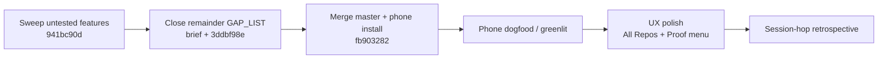
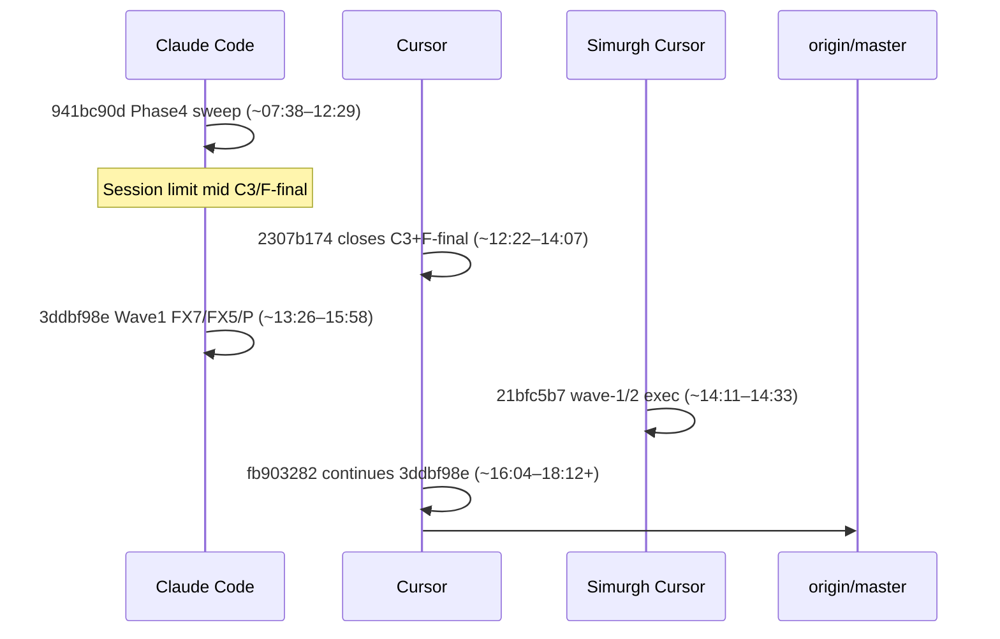

# SESSION HOP REPORT — Lancer untested-feature sweep → dogfood (2026-07-16)

**Audience:** Owner + next agent  
**Written:** 2026-07-16 ~18:15 ET · **amended ~18:20 ET** with verbatim session-message grounding  
**Method:** Session-history index + transcript mining of **actual USER/ASSISTANT text** (Claude JSONL + Cursor agent-transcripts + escalation brief), then **double-checked** against live `git fetch`, `gh pr list`, on-disk evidence, `lancerd doctor`, and audit/daemon logs.  
**Label key:** **VERIFIED** (live git/PR/file/log) · **CLAIMED-UNVERIFIED** (transcript/doc only) · **CONTRADICTED** (claim vs live evidence disagree)

**Prior draft audit (for the owner):** The first hop-report pass was **git/PR archaeology** — session IDs, merge SHAs, lane scoreboards — **without** a “Initial goals (from actual messages)” section and **without** quoting owner asks. This amendment adds §0 + intent evolution from the JSONL/`user_query` text below.

---

## 0. Initial goals (from actual messages)

Sources mined with `jq`/`python` on JSONL; quotes ≤2 lines; secrets redacted.

| Session | Verbatim owner ask (summary + quote) | Done-when they stated |
|---|---|---|
| **Claude `941bc90d…`** (Phase 4 sweep start) | Untested-feature live sweep via swarm-orchestrator. *“Goal: find every Lancer feature/surface that has real code behind it but has never been exercised by a live workflow, then close that gap — one real, realistic workflow per feature, run against a live simulator+daemon+relay stack…”* | *“Done when: one evidence-backed status per untested feature found (PASS with proof, FAIL with repro, or BLOCKED with the concrete blocker) written into … `GAP_LIST.md`-style ranked summary, and `docs/plans/orchestrator-state.md` updated…”* |
| **Claude `941bc90d…`** (mid + abort) | Mid: *“Logged into a new account… fan out as many subagents as you can and get this done asap”*; readiness ask *“is this ready to be pushed to the app store?”*; last human *“Continue from where you left off.”* | Stop cause (not a new done-bar): agent notifications *“You've hit your session limit · resets 3:10pm (America/Toronto)”* while C3 + F-final were still launching — assistant then *“No response requested.”* |
| **Escalation brief** `~/Downloads/lancer-fable-sweep-remaining-prompt.md` | **This is the Wave-1 Fable goal.** *“Exact ask: Decompose remaining open GAP_LIST items into exclusive lanes; route Cursor CLI vs Sonnet…; arbitrate product decisions; update orchestrator-state + GAP_LIST… Do not implement product fixes in the Fable session unless a sensitive-path full-diff review requires it.”* | Done bar in brief: each FAIL/BLOCKED closed or laned; *“#7 needsApproval UX fixed (or laned)”*; product call on #2/#3; re-pair/L6 status explicit; orchestrator ⚡ matches verified reality. |
| **Claude `3ddbf98e…`** (Wave 1) | `/plan` args: *“/Users/roshansilva/Downloads/lancer-fable-sweep-remaining-prompt.md, please use /swarm-ochestrator skill aggressively”*. AskUserQuestion answers: Policy/Audit → *“See how Orca and the other apps haddle this, and then follow exactly what they did”*; re-pair → *“Walk me through it now and then make sure to build the latest version on my phone please”*; #5 Connect → *“Fix it this sweep”*. Later: *“continue”* / *“continue”*. | Same brief done-bar; assistant recorded Wave 1 dispatch (FX7/FX5/Lane R→P) then died on *“API Error: 500 Internal server error…”* (~14:37 ET / `18:37:22Z`) mid FX7/Lane-P closeout. |
| **Cursor Simurgh `21bfc5b7…`** | *“Goal: Implement Simurgh improve-wave 1 so `simurgh exec` is usable with caller-supplied xcodebuild paths, keeps leases alive for the duration of the child process, and pins Simurgh home to the passwd home (not a polluted `$HOME`).”* | Done-when: no duplicate DD flags; exec auto-renews for child lifetime; `simurghHomeDir` passwd-home + HOME-mismatch fail-closed; `go test` suites green. |
| **Cursor parent `fb903282…`** | Chronological owner asks: (1) *“Read this claude code conversation, \`3ddbf98e…\`, and then continue working on it please”* → (2) look at Simurgh Cursor convo → (3) *“How long till this is all done and greenlit so i can start using the actual app for testing before we publish?”* → (4) *“Sounds good, fan out subagents and get this done ASAP”* → (5) *“…push and merge everything to master i want a clean workiing and testing slate. Then lets install the latest version on my phone and then start testing”* → (6) UX: *“takes too much time to load… all chats? and the prrof thing on every message is annoying, should be under a menu…”* → (7) *“Can you write a detailed report after seeing all the fable sessions and cursor sessions…”* → (8) *“Did you read the actual messages from the sesssoin? what the initial goal was etc etc?”* | Evolving: first continue Wave 1 → then dogfood/greenlit → merge+phone install → UX polish → retrospective hop report grounded in real messages. |

### Owner intent evolution

1. **Morning — live untested-feature sweep** (`941bc90d`): prove every coded surface with PASS/FAIL/BLOCKED evidence; App Store readiness was an explicit side question mid-session.  
2. **Afternoon — Fable remainder** (brief → `3ddbf98e`): fix #7/#5, decide #2/#3 via competitors, leave harness-BLOCKED items honest; owner also asked for phone build + re-pair walkthrough.  
3. **Parallel — Simurgh wave-1** (`21bfc5b7`): make `simurgh exec` stop reclaiming / duplicating flags so Lancer lanes stop fighting the lease tool.  
4. **Evening — Cursor continuation** (`fb903282`): continue Claude → ASAP fan-out → **clean master slate + install on phone** → dogfood → **All Repos speed + Proof under menu** → hop report → **“did you read the actual messages?”**.

---

## 1. Executive summary

On 2026-07-16 the owner ran a multi-tool arc: Claude Code (Fable/Sonnet swarm) discovered and fixed two P0 daemon bugs (F1/F4), then hit session limits mid live re-test; Cursor continued C3/F-final and Wave-1 product fixes (FX7/FX5/Lane P); Simurgh was improved the same day so `simurgh exec` stops reclaiming builds; Cursor parent `fb903282…` then merged the sweep to `master`, dogfooded the owner iPhone, and landed follow-on UX/daemon fixes through PR **#149**.

**Current `origin/master` tip (VERIFIED 2026-07-16 ~18:12 ET after `git fetch`):**

| Field | Value |
|---|---|
| SHA | `62b4424dc39df78d1a823bc33d7b597829ddc0e6` |
| Short | `62b4424d` |
| Subject | Merge pull request #149 from RoshanDewmina/fix/repos-chats-instant-load |
| When | 2026-07-16 18:03:09 -0400 |

**Dogfood / publish readiness (honest):**

| Area | Status | Label |
|---|---|---|
| Sweep code on master (F1/F4/FX7/FX5/Lane P/FX10) | Landed via #140–#141 | **VERIFIED** |
| Host daemon auth cold-start | Fixed (#145); doctor 12 OK, relay confirmed | **VERIFIED** |
| Phone pair | Live slot ends `…9884`; `paired with phone` through 17:43 ET | **VERIFIED** |
| Phone `"Hi"` launch after auth fix | Audit `conversation-append-launched allow` @ 21:20:25Z | **VERIFIED** |
| Full 10-step smoke (approve + follow-up + Policy/Audit UI screenshots) | Not fully evidenced | **CLAIMED-UNVERIFIED** / open |
| Publish / TestFlight / App Store | Not done | **VERIFIED** (absence) |
| Lane C4 #7 live re-proof | PARTIAL — pairing harness blocked; product not disproven | **VERIFIED** (LC4-report) |

**Bottom line:** Master is a real dogfood tip with the day's P0/P1 fixes merged. The phone is paired and can launch Claude turns again after the auth-preflight fix. Publish readiness is **not** closed — C4 review-chain live proof, full smoke UI evidence, and store ops remain open. Several docs (`DOGFOOD_READY.md` tip, local dirty checkout CHANGELOG, orchestrator ⚡ pair-BLOCKED section) are **stale relative to git/logs**.

---

## 2. Session timeline (chronological)

Times are **America/New_York (ET)** unless noted. UTC timestamps from Claude JSONL converted −4h.

### 2.1 Claude `941bc90d-92c1-43b5-98b0-325cd364a006` — Phase 4 untested sweep

| | |
|---|---|
| Path | `~/.claude/projects/-Users-roshansilva-Documents-command-center/941bc90d-92c1-43b5-98b0-325cd364a006.jsonl` |
| Window | first `2026-07-16T11:38:35Z` → last `2026-07-16T16:29:53Z` (~07:38–12:29 ET) |
| Role | Full fan-out: Lanes A2/B/C2/D2/E, Fix F1/F2/F3/F4, Phase 4 synthesis |

**Claimed done:** F1+F4 merged into `integration/2026-07-16-untested-sweep`; A2/C2/D2/E reports; F3 = env artifact; C3/F-final dispatched then aborted on session limit.

**Actually landed (VERIFIED on `origin/master`):**

- F1 merge `4e45dbaa` — bounded approval delivery retry  
- F4 merge `1f08c3c6` — approve→resume conversation-append launch  
- Lane reports under `docs/test-runs/2026-07-16-untested-feature-sweep/` (LA2, LB, LC2, LD2, LE, …)

**Handoff cause (verbatim):** dual agent failures *“You've hit your session limit · resets 3:10pm (America/Toronto)”* on “Retry terminal and D2 blocked candidates” + “Lane C3 final retry review candidates”; last owner text *“Continue from where you left off.”* → assistant *“No response requested.”* (Reports for C3/F-final appear only after Cursor `2307b174…`.)

### 2.2 Cursor `2307b174-526d-4655-9fbc-5b6ddff24979` — C3 + F-final closeout

| | |
|---|---|
| Path | `~/.cursor/projects/Users-roshansilva-Documents-command-center/agent-transcripts/2307b174-526d-4655-9fbc-5b6ddff24979/2307b174-526d-4655-9fbc-5b6ddff24979.jsonl` |
| Window | ~12:22–14:07 ET (timestamps in transcript) |
| Role | Continue aborted live lanes |

**Claimed done:** LC3 + LF-final reports; F4 live CLI+git proof; terminal PASS; #10 FAIL reconfirmed.

**Actually landed (VERIFIED files):**

- `LC3-report.md` — F4 live-proven (`474f104 sweep edit` in `/tmp/sweep-C3/target-repo`); review UI still FAIL on sync `needsApproval`  
- `LF-final-report.md` — terminal open+usage PASS; #10/#14/#11/#18 FAIL/BLOCKED  
- `GAP_LIST.md` Phase-4 scoreboard (later overwritten/extended by Wave 1)

**Incident (VERIFIED in LC3-report):** bare `lancerd pair` without `LANCER_STATE_DIR` rotated production pairing to historical code `310440`.

### 2.3 Claude `3ddbf98e-d30a-462c-a33f-4efe36ce7849` — Wave 1 remainder (Fable)

| | |
|---|---|
| Path | `~/.claude/projects/-Users-roshansilva-Documents-command-center/3ddbf98e-d30a-462c-a33f-4efe36ce7849.jsonl` |
| Window | first `2026-07-16T17:26:04Z` → last `2026-07-16T19:58:14Z` (~13:26–15:58 ET) |
| Role | Owner escalation brief: Lane R decision, FX7/FX5/Lane P |

**Claimed done:** Product decision #2/#3 (coarse mode + audit over relay; YAML stays SSH); FX7/FX5/P in flight or code-done; Keychain serialization note.

**Actually landed (VERIFIED ancestors of `origin/master`):**

| Lane | Commit(s) | Merge |
|---|---|---|
| Lane R research | `docs/product/2026-07-16-policy-audit-relay-port-map.md` (199 lines) | On master via #140 docs |
| FX7 | `a7749650` | `543566ba` |
| FX5 | `a8a91761` | `2a872e1e` |
| Lane P | `4382f1b8` + `7b4d4695` | `7707e4fa` |
| Sentry cleanup | `faeb80c9` | in tip before #140 |

**Handoff (verbatim):** Assistant hit *“API Error: 500 Internal server error…”* (`18:37:22Z`); owner typed *“continue”* twice with no further durable closeout in this JSONL. Cursor parent then opened with *“Read this claude code conversation, \`3ddbf98e…\`, and then continue working on it please”*.

### 2.4 Cursor Simurgh `21bfc5b7-883f-4024-8258-e1e54f17445f` — wave-1/2 same day

| | |
|---|---|
| Path | `~/.cursor/projects/Users-roshansilva-Documents-simurgh/agent-transcripts/21bfc5b7-883f-4024-8258-e1e54f17445f/21bfc5b7-883f-4024-8258-e1e54f17445f.jsonl` (+ `subagents/`) |
| Window | ~14:11–14:33 ET (parent); subagents longer |
| Role | Fix `simurgh exec` friction discovered by Lancer sweep |

**Claimed done:** Wave-1 usable exec (caller paths, lease keepalive, passwd `$HOME`); wave-2 fan-out (busy/hold, MCP home, docs).

**Actually landed (VERIFIED local Simurgh tip at report time):** `85f3907` — `fix(bench): P0 sidecars, report timing, xcodebuildmcp harness` (and related day's commits on that repo). Lancer docs claim Simurgh wave-1/2 @ `85f3907` in orchestrator ⚡ ~16:20 — **VERIFIED** tip string matches local Simurgh HEAD subject family.

### 2.5 Cursor parent `fb903282-2d06-4471-9542-5aaafbbe41e1` — merge → dogfood → UX follow-ons

| | |
|---|---|
| Path | `~/.cursor/projects/Users-roshansilva-Documents-command-center/agent-transcripts/fb903282-2d06-4471-9542-5aaafbbe41e1/fb903282-2d06-4471-9542-5aaafbbe41e1.jsonl` |
| Subagents | 19 under `…/fb903282…/subagents/` |
| Window | 16:04 ET → ongoing past 18:12 ET |

**Major subagent chain (CLAIMED roles; landings VERIFIED via PRs where noted):**

| Subagent ID | Task | Landed? |
|---|---|---|
| `286bec69…` | Owner merge-all + FX10 + phone install | **VERIFIED** #140–#143 → tip `ec3565f7` |
| `51462427…` | FX10 #10 pill diagnose | **VERIFIED** `5a3fce93` on master |
| `d818a06a…` / `d3248a2a…` | DOGFOOD_READY + device build | **VERIFIED** file + 16:34 build log |
| `0ff947dd…` / `3679d8fc…` | Pair + smoke watch (no remint) | Pair **VERIFIED** in daemon log |
| `31cbb159…` | Auth-preflight fix | **VERIFIED** #145 `1a51329b` |
| `5424976e…` | Docs PASS after auth | **VERIFIED** #146 |
| `3a8726d3…` | Merge Policy SSH stale | **VERIFIED** #144 |
| `3ca8e156…` / `cd8bdebb…` | ISO8601 CI flake | **VERIFIED** #148 |
| `44ff2085…` / `5943d86c…` | Proof under menu + reinstall | **VERIFIED** #147; install **CLAIMED SUCCEEDED** @ `655232eb` |
| `e0d9b1e6…` / `f9b86096…` | All Repos instant load + reinstall | **VERIFIED** #149; install **CLAIMED SUCCEEDED** @ `62b4424d` (retry after CoreDevice 4000) |
| `fa57ccca…` / `8ea0c39e…` | C4 live lane | **VERIFIED** `LC4-report.md` PARTIAL |
| `2758f384…` | This session-hop report | (this file) |

### 2.6 Parallel worktree implementers (Wave 1 coding)

| Session | Path | Role |
|---|---|---|
| `8880d5e0…` | `…-worktrees-fx7-needsapproval/agent-transcripts/…` | FX7 implementer (~13:43–14:15) |
| `ee05c5ec…` | `…-worktrees-fx5-connect-occlusion/…` | FX5 implementer (~13:43–13:45+) |
| `35df53db…` | `…-worktrees-untested-sweep-2026-07-16/…` | Integration review |

---

## 3. Lane scoreboard — claimed vs verified

| Lane / PR | Claimed | Verified on `origin/master` | Live proof | Verdict label |
|---|---|---|---|---|
| **F1** first-send approval retry | Fixed + merged | `065481d9` → `4e45dbaa` | C2/C3 live approval sends | **VERIFIED** |
| **F4** approve→launch resume | Fixed + merged | `ec425b40` → `1f08c3c6` | C3 real `claude` + git `474f104` | **VERIFIED** |
| **F2** addrepo truncation | Drop / false bug | No product merge | — | **VERIFIED** (correctly dropped) |
| **F3** pairing disagreement | Env artifact | Doc branch only (not required on master) | F-final terminal PASS under light load | **VERIFIED** |
| **Lane R** competitor port-map | Done | `docs/product/2026-07-16-policy-audit-relay-port-map.md` (199 lines) | — | **VERIFIED** |
| **FX7** needsApproval→awaiting | Merged Wave 1 | `a7749650` / `543566ba` via #140 | C4 did **not** observe awaiting card (`awaitingCard=false`) | Code **VERIFIED**; live **CLAIMED-UNVERIFIED** / still owed |
| **FX5** Connect above keypad | Merged Wave 1 | `a8a91761` / `2a872e1e` via #140 | C4 `LC4-01-pairing-keypad.png` PASS | **VERIFIED** |
| **Lane P** audit+mode relay | Merged Wave 1 | `4382f1b8`/`7b4d4695`/`7707e4fa` via #140 | C4 Audit PASS; Policy PARTIAL (stale SSH) | **VERIFIED** (partial live) |
| **sentry Package.resolved** | Contaminated then stripped | `faeb80c9` on master | — | **VERIFIED** |
| **C4** post-Wave-1 live | PARTIAL | `LC4-report.md` + screenshots | Daemon never `paired with phone` in harness | **VERIFIED** PARTIAL |
| **FX10** bg-tasks pill | Code FIXED | `5a3fce93` via #141 | Live re-proof still owed | Code **VERIFIED**; live open |
| **#144** Policy stale SSH | Merged | `83601ef2` / `ebc336f6` | Unit/CI; phone UI re-proof owed | Code **VERIFIED** |
| **#145** auth-preflight | Merged | `1a51329b` / `e7f06059` | Audit deny@21:05Z → allow@21:19Z/21:20Z | **VERIFIED** |
| **#146** dogfood PASS docs | Merged | `7a1f8cd5` / `f817f336` | Matches audit | **VERIFIED** (launch); UI screenshot still missing |
| **#147** Proof under menu | Merged + phone install | `655232eb` / `34d1f2de` | Install claimed SUCCEEDED | Code **VERIFIED**; UX **CLAIMED-UNVERIFIED** |
| **#148** ISO8601 tests | Merged | `9c520abb` | CI-oriented | **VERIFIED** |
| **#149** All Repos cache paint | Merged + phone install | `62b4424d` / `6b05372c` | Install claimed SUCCEEDED @ ~18:05 | Code **VERIFIED**; UX **CLAIMED-UNVERIFIED** |

### Doc vs git contradictions

| Doc claim | Live truth | Winner |
|---|---|---|
| `DOGFOOD_READY.md` tip `b8bb778c` / orphaned pair `310440` | Master is `62b4424d`; pair live ends `…9884`; doctor relay confirmed | **Docs stale** (historical snapshot ~16:25) |
| `orchestrator-state.md` ⚡ ~16:58 “smoke BLOCKED on pair” | Later DOGFOOD_SMOKE + audit show pair+launch PASS; also duplicate ⚡ C4 section | **Orchestrator partially stale** — keep newest PASS evidence |
| Local workspace `docs/CHANGELOG.md` (dirty branch) sparse 2026-07-16 | `origin/master` CHANGELOG has full #140–#149 lines | **Local checkout wrong/stale**; trust `origin/master` |
| `GAP_LIST.md` tip still `b8bb778c` / “merge in progress” | Merge complete (#140+) | **GAP_LIST tip stale**; candidate verdicts still useful |
| DOGFOOD_SMOKE “app @ `ec3565f7`” | Later installs claimed @ `655232eb` then `62b4424d` | **SMOKE build tip stale** vs later install agents |

---

## 4. What is on the phone now

| Item | Best evidence | Label |
|---|---|---|
| Device | Roshan’s iPhone UDID `557A7877-F729-5031-9606-0E04F2B67822` (`devicectl` available) | **VERIFIED** |
| App install tip | Subagent `f9b86096…` reports install **SUCCEEDED** of `62b4424d` (~18:05 ET) after CoreDevice disconnect retry; `.app` mtime `2026-07-16 18:05:25` at `/tmp/lancer-device-dogfood-dd/Build/Products/Debug-iphoneos/Lancer.app` | Install path **VERIFIED**; “phone UI running that binary” **CLAIMED-UNVERIFIED** (no Info.plist dump from device) |
| Prior installs same day | 16:34 `b8bb778c`; ~16:50 FX10/`ec3565f7`; ~17:36 Proof `655232eb` | **VERIFIED** via DOGFOOD_* + subagent returns |
| Pairing | `lancerd doctor`: relay pairing **confirmed** on `wss://conduit-push.fly.dev`; slot code length 6 ending `…9884` (DOGFOOD_SMOKE names this identity historically); last `paired with phone` lines 17:02, 17:19, 17:30, 17:38, 17:43 ET | **VERIFIED** (no remint this report) |
| Host daemon | Resident reachable; binary `/Users/roshansilva/.lancer/bin/lancerd`; post-#145 auth fix in tree + smoke evidence | **VERIFIED** |
| Auth smoke | Deny `conversation-append-auth-preflight` @ `2026-07-16T21:05:24Z` for `"Hi"`; then allow launches @ `21:19:07Z` (host probe) and `21:20:25Z` (phone `"Hi"`) | **VERIFIED** |
| UI screenshot of completed turn | Not in evidence tree for tonight’s phone `"Hi"` | **CLAIMED-UNVERIFIED** / missing |

**Redaction note:** Live pairing private/public keys not reproduced. Historical expired mints (`310440`, `758455`, `347051`) appear in docs as incident history only.

---

## 5. Still open / not proven

1. **Lane C4 #7 chain** (#8/#9/#17/#23) — harness never got `paired with phone`; FX7 awaiting-card not observed live.  
2. **#10 / #14 live** — FX10 code on master; pill/chip hydration not re-proven on phone or fixed C4.  
3. **Full dogfood checklist** (`DOGFOOD_READY.md` §4 items 3–10) — approve path, follow-up, Policy/Audit UI screenshots, Emergency Stop, lock-screen push — not fully evidenced tonight.  
4. **Publish / TestFlight / App Store** — still open per publish checklist.  
5. **Doc hygiene** — refresh `DOGFOOD_READY.md`, `GAP_LIST.md` tip, and stale orchestrator ⚡ pair-BLOCKED blocks so they match `62b4424d` + PASS smoke.  
6. **Local agent checkout** — this workspace is on `cursor/desktop-history-and-terminal-3510` (ahead/dirty), **not** clean `master`; do not confuse with `origin/master`.  
7. **Worktrees still present** under `.worktrees/` (`untested-sweep-2026-07-16`, `fx7-needsapproval`, `fx5-connect-occlusion`, `fx10-bg-tasks`, `fix-auth-preflight-dogfood`, `fix-proof-under-menu`, `fix-repos-load-speed`, `fix-policy-ssh-stale`, `fix-iso8601-tests`, …) — cleanup optional, not proven retired.

---

## 6. Lessons

| Lesson | Evidence | Takeaway |
|---|---|---|
| **Session-hop waste** | Claude `941bc90d` aborted C3/F-final; Cursor re-derived context; later Claude `3ddbf98e` → Cursor `fb903282` again | Write a one-page handoff (tip SHA, open lanes, stop conditions) *before* limit; do not trust prior “done” |
| **Keychain test collision** | Orchestrator: FX5 gates serialized behind FX7 | Never run parallel LancerKit test suites from two worktrees sharing macOS Keychain |
| **Package.resolved sentry contamination** | `faeb80c9` dropped accidental sentry-cocoa pin from FX7 | Diff `Package.resolved` on every iOS PR; treat unexpected pins as merge blockers |
| **Auth-preflight timeout** | Launchd cold `claude auth status` ~13s vs 20s budget → false deny; #145 → 35s + warm + PATH | Resident env ≠ interactive shell; measure under launchd |
| **Simurgh exec discipline** | Sweep hit reclaim + duplicate `-derivedDataPath`; Simurgh wave-1/2 + Lancer AGENTS mandate `simurgh exec` | Never bare `xcodebuild` on leased sims; don’t set polluted `$HOME` for lease metadata |
| **Production pair slot is single** | Bare `lancerd pair` without `LANCER_STATE_DIR` orphaned phone (`310440` incident) | Isolate sweep daemons; never `lancerd pair --help` |
| **Docs drift faster than git** | DOGFOOD_READY / GAP_LIST / local CHANGELOG lag master | Prefer `origin/master` + audit.log over narrative docs |
| **Device install flakiness** | #149 install CoreDeviceError 4000 then retry OK | Treat first `devicectl` failure as reconnectable; confirm `.app` mtime |

---

## 7. Evidence appendix

### 7.1 Session file paths

| ID | Store path |
|---|---|
| Claude Phase 4 | `/Users/roshansilva/.claude/projects/-Users-roshansilva-Documents-command-center/941bc90d-92c1-43b5-98b0-325cd364a006.jsonl` |
| Claude Wave 1 | `/Users/roshansilva/.claude/projects/-Users-roshansilva-Documents-command-center/3ddbf98e-d30a-462c-a33f-4efe36ce7849.jsonl` |
| Cursor C3/F-final | `/Users/roshansilva/.cursor/projects/Users-roshansilva-Documents-command-center/agent-transcripts/2307b174-526d-4655-9fbc-5b6ddff24979/2307b174-526d-4655-9fbc-5b6ddff24979.jsonl` |
| Cursor dogfood parent | `/Users/roshansilva/.cursor/projects/Users-roshansilva-Documents-command-center/agent-transcripts/fb903282-2d06-4471-9542-5aaafbbe41e1/fb903282-2d06-4471-9542-5aaafbbe41e1.jsonl` |
| Cursor parent subagents | `…/fb903282-2d06-4471-9542-5aaafbbe41e1/subagents/*.jsonl` (19 files) |
| Simurgh Cursor | `/Users/roshansilva/.cursor/projects/Users-roshansilva-Documents-simurgh/agent-transcripts/21bfc5b7-883f-4024-8258-e1e54f17445f/21bfc5b7-883f-4024-8258-e1e54f17445f.jsonl` |
| FX7 worktree | `…/command-center-worktrees-fx7-needsapproval/agent-transcripts/8880d5e0-…/8880d5e0-….jsonl` |
| FX5 worktree | `…/command-center-worktrees-fx5-connect-occlusion/agent-transcripts/ee05c5ec-…/ee05c5ec-….jsonl` |

### 7.2 Merged PRs (sweep→dogfood day)

| PR | URL | Merge SHA | Merged (UTC) |
|---|---|---|---|
| #140 | https://github.com/RoshanDewmina/conduit/pull/140 | `99fd4526fd4c…` | 2026-07-16T20:35:40Z |
| #141 | https://github.com/RoshanDewmina/conduit/pull/141 | `fbc85191be4b…` | 2026-07-16T20:44:32Z |
| #142 | https://github.com/RoshanDewmina/conduit/pull/142 | `9ff3e6b491df…` | 2026-07-16T20:51:59Z |
| #143 | https://github.com/RoshanDewmina/conduit/pull/143 | `ec3565f75711…` | 2026-07-16T20:52:20Z |
| #144 | https://github.com/RoshanDewmina/conduit/pull/144 | `83601ef2dc47…` | 2026-07-16T21:17:00Z |
| #145 | https://github.com/RoshanDewmina/conduit/pull/145 | `1a51329bf0ca…` | 2026-07-16T21:20:20Z |
| #146 | https://github.com/RoshanDewmina/conduit/pull/146 | `7a1f8cd510ec…` | 2026-07-16T21:23:19Z |
| #147 | https://github.com/RoshanDewmina/conduit/pull/147 | `655232eb5715…` | 2026-07-16T21:36:16Z |
| #148 | https://github.com/RoshanDewmina/conduit/pull/148 | `9c520abbfc03…` | 2026-07-16T21:38:54Z |
| #149 | https://github.com/RoshanDewmina/conduit/pull/149 | `62b4424dc39d…` | 2026-07-16T22:03:10Z |

### 7.3 Key SHAs (all **VERIFIED** ancestors of `origin/master`)

`4e45dbaa` F1 · `1f08c3c6` F4 · `a7749650`/`543566ba` FX7 · `a8a91761`/`2a872e1e` FX5 · `4382f1b8`/`7707e4fa` Lane P · `faeb80c9` sentry strip · `5a3fce93` FX10 · `99fd4526` #140 · `ebc336f6` #144 · `e7f06059` #145 · `34d1f2de` #147 · `9c520abb` #148 · `6b05372c` #149 · **tip `62b4424d`**.

### 7.4 Sweep evidence tree

`docs/test-runs/2026-07-16-untested-feature-sweep/` — `GAP_LIST.md`, `LC3-report.md`, `LC4-report.md`, `LF-final-report.md`, `DOGFOOD_READY.md`, `DOGFOOD_SMOKE.md`, `screenshots/LC4-*.png`, `LC3-git-proof.txt`, …

### 7.5 Live checks run for this report (read-only)

- `git fetch` + `git log origin/master --oneline -40`  
- `gh pr list --state merged` (#140–#149)  
- `git merge-base --is-ancestor <sha> origin/master` for table SHAs  
- `lancerd doctor` (relay confirmed)  
- `rg 'paired with phone' ~/.lancer/lancerd.stderr.log`  
- `rg 'conversation-append-' ~/.lancer/audit.log`  
- Session index: `list-agent-sessions.sh 3` on command-center + simurgh  

**Not done (per instructions):** remint pair, push, merge, product code edits, changelog commit (workspace dirty / wrong branch).

---

*End of report. Copies: this path + `/Users/roshansilva/Downloads/2026-07-16-lancer-session-hop-report.md`.*
