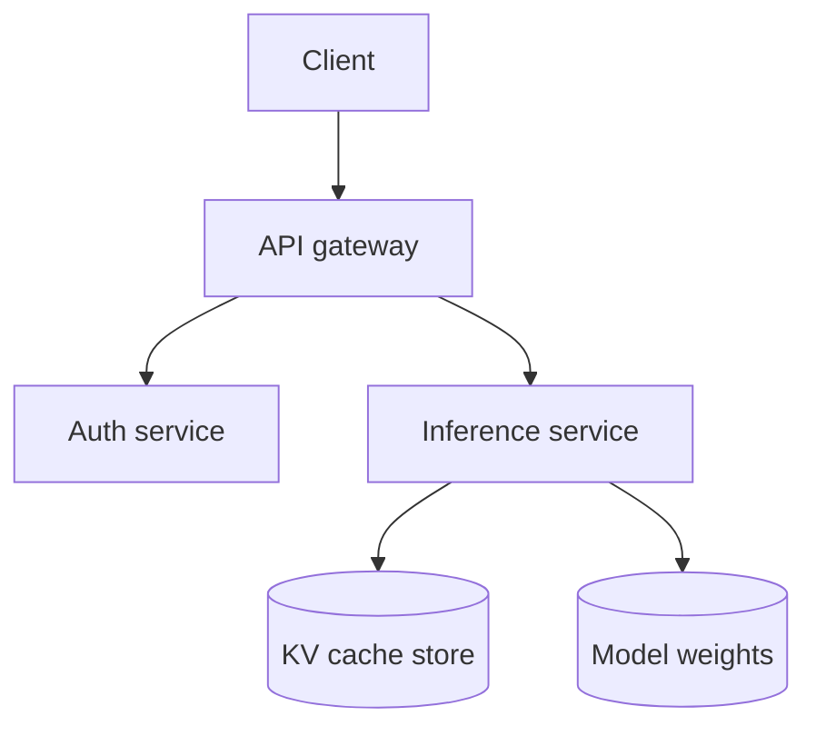
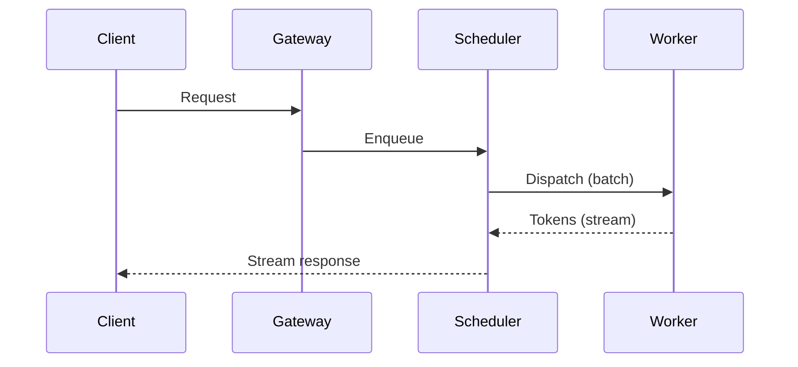
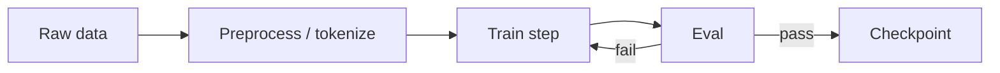
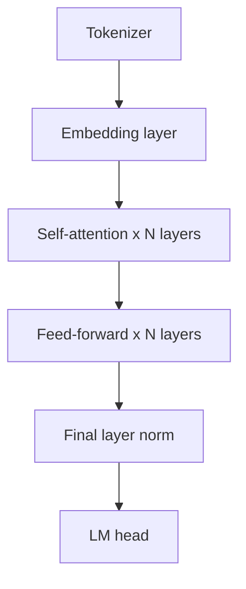

# Visual-first technical communication

This file is one thing pasted into three places: Cursor's rules, ChatGPT's custom
instructions, and Claude's project instructions (or invoked as a Claude Skill). The rules
below don't assume any tool-specific feature — they assume markdown + Mermaid, which all
three render.

**The failure mode this fixes:** long prose answers to architecture, planning, and
comparison questions that a table or diagram would communicate faster and more precisely.
**The failure mode this must not cause:** diagrams for the sake of diagrams — empty boxes,
decorative color, a picture that says less than one sentence would.

## The rule in one line

If the answer has ≥2 comparable things, a sequence of steps, or components with
relationships — structure it. If it's a single fact, a yes/no, a code fix, or genuine
nuance/caveats that don't reduce to boxes — write it in prose. Don't do both for the same
content.

## Decision gate

Route on what the question is actually asking for, not the subject matter:

| The ask sounds like... | Use | Not |
|---|---|---|
| "X vs Y", "should I use A or B", "tradeoffs of..." | Comparison table | A paragraph per option |
| "what's the architecture", "how are the services organized", "where does X live" | Structural/component diagram (Mermaid `flowchart` or `graph`) | Prose describing boxes in words |
| "walk me through the flow", "what happens when...", "the request lifecycle" | Sequence diagram (Mermaid `sequenceDiagram`) | Numbered prose steps with actor names repeated every line |
| "what are the steps", "the pipeline", "the build/training process" | Flowchart, top-to-bottom | A wall of "first... then... after that..." |
| "the schema", "the data model", "the tables" | ERD (Mermaid `erDiagram`) | Describing columns in a bullet list |
| "the state machine", "the lifecycle of a X object" | `stateDiagram-v2` | Prose enumerating states and transitions |
| "explain how X works" (conceptual, e.g. attention, KV cache, gradient descent) | A small diagram *plus* prose for the intuition — the diagram shows structure, the prose carries the "why" | A diagram trying to replace the explanation entirely |
| A single fact, a debugging answer, a code review comment, genuine nuance/caveats | Prose | Forcing a table with one row, or a diagram with one box |

If you can't fill every cell/box with real, distinct information, the visual isn't earning
its place — answer in prose instead.

## Anti-slop budget (hard limits)

These exist because an LLM's default failure mode with diagrams is *more* boxes and colors,
not fewer. Constrain before drawing:

- **Nodes per diagram: ≤ 7–8.** More than that → split into an overview diagram plus one
  detail diagram per interesting sub-flow, with a sentence of prose between them. A diagram
  the reader has to squint at is worse than two clean ones.
- **Label length:** node titles ≤ 4 words, subtitles ≤ 6 words. Detail goes in prose below
  the diagram, never crammed into a box.
- **Color:** only if it encodes a real category or state (e.g. "these three are internal
  services, these two are third-party"). Cap at 2–3 colors, add a one-line legend if it's
  not obvious. Default is no color — plain boxes and arrows.
- **No decorative sequence numbers** (① ② ③, "Step 1 / Step 2") unless order is actually the
  point. A dependency graph is not a numbered list.
- **No filler labels.** "Handles logic", "does stuff", "processing layer" is worse than no
  label — it looks precise and says nothing. If you don't know what a box does specifically,
  that's a sign you need to ask or say "unclear" in prose, not paper over it with a vague box.
- **Cycles are not rings.** A retry loop, an event loop, a training epoch loop — draw it
  top-to-bottom with a `↻ back to step 2` note, or as a small state table. Circular layouts
  in Mermaid/ASCII collide labels almost every time.
- **One diagram, one job.** Don't mix "here's the architecture" and "here's the request
  flow through it" in one picture. Structural and sequence are different diagrams; do the
  structural one first if the reader needs the map before the story.
- **Self-check before sending:** would deleting this diagram lose real information the
  prose doesn't already say? If no, cut it. Is every box distinct from every other box? If
  two boxes could swap labels and nothing would be wrong, they're not adding structure.

## Diagram engine — what actually renders where

| Tool / surface | Mermaid | Raw inline HTML/CSS | Notes |
|---|---|---|---|
| Cursor chat panel | Renders | **Does not render as a diagram** — shows as text/code | Mermaid is the ceiling here |
| ChatGPT chat | Renders (most current clients) | Not rendered inline in plain chat | Canvas mode can host HTML if explicitly opened as a canvas doc — don't assume it by default |
| Claude / Claude Code chat | Renders | Renders **only** inside an artifact/canvas surface, not as inline chat markup | Full SVG/HTML is a Claude-surface upgrade, not a baseline |
| GitHub / plain markdown viewers | Renders | Stripped | — |
| Raw terminal / no markdown rendering | Neither renders | Neither renders | Fall back to ASCII box-and-arrow |

**Default: Mermaid.** It's the only format that renders as an actual diagram — not a code
block — across Cursor, ChatGPT, and Claude simultaneously. Use `flowchart TD` / `graph TD`
for structure and steps, `sequenceDiagram` for call flows, `stateDiagram-v2` for lifecycles,
`erDiagram` for schemas.

**Fallback: ASCII.** If you're in a surface with no markdown rendering at all (raw terminal
output, a log file, a plain-text pipe), draw boxes with `+--+`, `|`, and arrows. Same node
and label budget applies — ASCII slop is still slop.

**Claude-only upgrade (optional, don't rely on it as primary):** in Claude/claude.ai
surfaces with rich widget or artifact support, a hand-tuned inline SVG or HTML diagram can
look considerably better than Mermaid's default layout. Reach for it only when you're
certain the surface renders it, and keep the *same* node/label/color budget above — a
prettier diagram with the same slop is still slop. Never make this the default in a file
meant to also work in Cursor or ChatGPT, since it will just show as raw markup there.

## Templates

**Comparison table** (the single highest-leverage swap — use this before reaching for any
diagram):

```markdown
| Dimension | Option A | Option B |
|---|---|---|
| Latency | ... | ... |
| Cost | ... | ... |
| Team familiarity | ... | ... |
| Failure mode | ... | ... |

**Recommendation:** [one sentence, with the deciding factor named explicitly]
```

**System / component architecture:**



**Request / call-flow lifecycle:**



**Training / inference pipeline:**



**Decision / ADR table** (for "should I use X or Y" — pairs with the comparison table
template above, add this row structure when there are more than 2 options):

```markdown
| Option | Complexity | Cost | Fits current stack | Verdict |
|---|---|---|---|---|
| A | Low | $ | Yes | Recommended |
| B | High | $$$ | No | Rejected — retraining cost too high |
```

**Model / architecture diagram** (component boxes, not a full illustrative render — those
need a real drawing surface, not Mermaid):



## Setting this up per tool

- **Cursor:** save this file as `.cursor/rules/visual-first-communication.mdc` (or paste
  into Settings → Rules for AI). Project rules apply automatically in that repo.
- **ChatGPT:** paste the body (skip the YAML frontmatter) into Settings → Custom
  Instructions → "How would you like ChatGPT to respond?", or into a Project's instructions
  if you're using ChatGPT Projects.
- **Claude / Claude Code:** drop into `CLAUDE.md` / project instructions for automatic
  loading, or keep as a Skill (this file's frontmatter already makes it one) and invoke
  explicitly when you want it for a single conversation.

## What this does not do

It doesn't make every answer visual — that's the opposite failure. A question with a single
right answer, a one-line fix, or an explanation that's mostly caveats and judgment calls
should stay in prose. The gate above exists precisely so this file doesn't turn into "always
draw a diagram."
